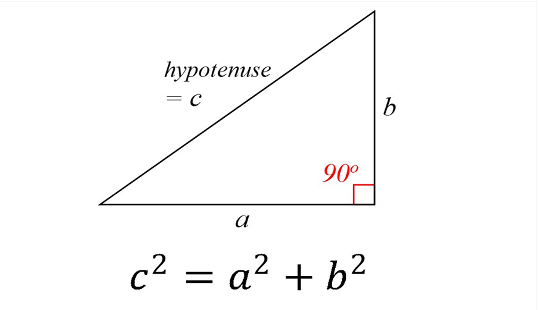
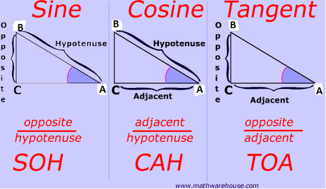
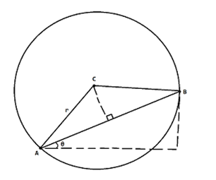

slidenumbers: true
slidecount: true
autoscale: true
slide-transition: true

# Welcome to CS2030S Lab 1!
## 3 August 2021 [16A]

[.slidenumbers: false]

---
# The Team
**Marcus** Tan Wei
Year 3 Computer Science

Chen **YiJia**
Year 3 Applied Math

---

# What does CS2030/S teach you?

Java?
Vim?
Linux?
Terminal?

---

# What does CS2030/S teach you?

[.column]
~~Java?~~
~~Vim?~~
~~Linux?~~
~~Terminal?~~

[.column]
Programming Paradigms
Design Patterns

---

# What does CS2030/S teach you?

> Programs are meant to be read by humans and only incidentally for computers to execute.
-- Harold Abelson and Gerald Jay Sussman

---

# What does CS2030/S teach you?


---

# Admin Information

| Continuous Assessments                           | Weightage (60%) |
| ------------------------------------------------ | --------------- |
| Practical Assessment 1                           | 15              |
| Practical Assessment 1                           | 20              |
| Individual Project                               | 10              |
| Weekly Labs                                      | 5               |
| Class Participation and Peer Learning Activities | 5               |
| In-lecture quiz                                  | 5               |

---

# Java Primer: String equality

- Use `.equals()` instead of `==` to compare Strings.
- `==` compares memory addresses.

---

# Java Primer: Class equality

- Java classes have their own implementation of `.equals()`. Read the [API](https://docs.oracle.com/en/java/javase/11/docs/api/java.base/java/lang/String.html#equals(java.lang.Object)).
- When creating your own custom class, `.equals()` is *inherited* from the `Object` class.
- Default implementation of `.equals()` is to compare memory addresses, so calling `.equals()` within your custom class is the same as using `==`.
- *Override* the `.equals()` method with an implementation that you want to use.

---

# Java Primer: toString

- JShell uses a class's `toString` implementation to print output.
- Override the `toString` method to make it print a custom string.

---

# Java Primer: `@Override` tag

```java
@Override
public String toString() {
    return "Hello World";
}
```

- Not necessary to include it, but good to have.
- If the tag is included, the code will not compile if the method is not overriden properly.
- Useful for checking that you have overriden the correct method/overriden the method properly.

---

# Java Primer: Passing by value

- In Java, variables are passed by value.
- A copy of the information that is stored in the variable is passed into methods as parameters.

---

# Java Primer: Passing by value

```java
private static void swap(int a, int b) {
    int temp = a;
    a = b;
    b = temp;
}
```

```java
int a = 1;
int b = 2;
swap(a, b);
System.out.println("a: " + a + ", b: " + b);
```

```
[Output] a: 1, b: 2 # Swap does not occur
```

- Primitive types store the actual values.
- A copy of the value is passed to the swap method.

---

# Java Primer: Passing by value

```java
private static void swap(int[] array, int a, int b) {
    int temp = array[a];
    array[a] = array[b];
    array[b] = temp;
}
```

```java
int[] array = {0, 1};
swap(array, 0, 1);
System.out.println("first entry: " + array[0] + ", second entry: " + array[1]);
```

```
[Output] first entry: 1, second entry: 0 # Swap occurs
```

- Reference types (classes) store memory addresses.
- A copy of the memory address is passed to the `swap` method.

---

# Java Style: Avoid magic numbers

```java
int numberOfMinutes = numberOfSeconds / 60;
```

What does 60 mean in the above line of code? You may have guessed that 60 represents the number of seconds in one minute. However, you only knew because you had the benefit of prior contextual knowledge (i.e. you know about the concept of time, and could thus infer what the number 60 meant).
We refer to 60 as a **magic number**; you need prior context to understand it. In general, we try to avoid magic numbers to make our code is more readable.

---

# Java Style: Avoid magic numbers

```java
private static final int NUMBER_OF_SECONDS_IN_ONE_MINUTE = 60;
int numberOfHours = numberOfSeconds / NUMBER_OF_SECONDS_IN_ONE_MINUTE;
```

- We give magic numbers meaning by assigning them to constants.
- Variables which hold constant values typically have `static` and `final` keywords.
- Their names are also canonically written in all uppercase with consecutive words being separated by underscores.
- Benefit: You only need to change the value once if you use it in multiple places.


---

# Java Primer: Comparing floating point numbers

```java
if (double 1 == double 2) {
    // do something
}
```

- You may be accustomed to doing something like the above to compare to floating point numbers (i.e. numbers with some value after the decimal point, like 1.0, 123.123, etc.).
- The above code does not always work!
- It has to do with how floating point numbers are represented in Java (you will learn more if you take CS2100).

---

# Java Primer: Comparing floating point numbers

```java
private static final double THRESHOLD = 1E-15; // 10^-15
if (Math.abs(double1 - double2) <= THRESHOLD) {
    // do something
}
```

- We need to do something like the above instead.
- Basically, we check that the difference between both numbers is smaller than some small threshold value when comparing for “equality”.
- `Math.abs` takes the absolute (non-negative) value of the number being passed to it.

------

# Common Bash (Linux) Commands

| Action                          | Usage                |
| ------------------------------- | -------------------- |
| List directory contents         | `ls`                 |
| Renaming a file                 | `mv` oldname newname |
| Deleting a file                 | `rm` filename        |
| Auto-complete                   | Tab ↹                |
| Navigating between old commands | ⬆️⬇️                   |

------

# Common Vim Commands

| Action                  | Usage                                                       |
| ----------------------- | ----------------------------------------------------------- |
| Indent all code in file | `gg=G` (`gg` moves the cursor to the beginning of the file) |
| Undo                    | `U`                                                         |
| Auto-complete           | `Ctrl + N`                                                  |
| Jump to start of line   | `0`                                                         |
| Jump to end of a line   | `$`                                                         |
| Delete a line           | `DD`                                                        |


---

# Common Vim Commands

| Action                         | Usage       |
| ------------------------------ | ----------- |
| Enter Visual-Line mode         | `Shift + V` |
| [Visual Line] Move cursor      | ➡️⬅️⬆️⬇️        |
| [Visual Line] Delete           | `D`         |
| [Visual Line] Cut              | `X`         |
| [Visual Line] Copy/Yank        | `Y`         |
| [Visual Line] Paste            | `P`         |
| Split window horizontally      | `:sp`       |
| Split window vertically        | `:vsp`      |
| Navigate between split windows | `Ctrl + W`  |
| New tab                        | `:tabnew`   |

------

# Lab 1: Instructions

1. Connect to `stu.comp.nus.edu.sg` to attempt lab.
   - Run `/home/course/cs2030/bin/setup`
2. Question is on [CodeCrunch](https://codecrunch.comp.nus.edu.sg/).
3. Once done, you can download your files using the `scp` command. (next slide)
4. You may wish to explore other GUI options (e.g. FileZilla) if you are more comfortable with them.

------

# Lab 1: Instructions

`scp` command synopsis:

```
scp [OPTIONS] [user@]SRC_HOST:]file1 [user@]DEST_HOST:]file2
```

Example:

```bash
scp lyskevin@stu.comp.nus.edu.sg:file.txt /Users/lyskevin/Desktop
```

- In the above command, we send a copy of file.txt in the main directory of a stu account to the `/Users/lyskevin/Desktop` directory of the device (i.e. someone’s laptop).

- `[OPTIONS]` was not used (left empty) and the command was run that person’s laptop.

------

# Lab 1: Instructions

What if you want to send over a folder? Zip it first!

```bash
zip -r cs2030_folder.zip cs2030_folder
```

- The above command is run from within the **stu** server and creates a ZIP file called `cs2030_folder.zip` using the contents of a folder named `cs2030_folder`.

- `-r` denotes a recursive operation: there may be other files/folders inside the `cs2030_folder` folder, so we need to recursively check for those as well if we want them to be included inside the final ZIP file.

------

# Lab 1: Math Recap

- How to calculate the distance between two points?
- Use simple math you learnt in your high school!
- Use trigonometry to get your angle between two lines.



------

# Lab 1: Level 3 Hint



------

# Miscellaneous Checklist

- [ ] vim
- [ ] ssh, scp
- [ ] tmux
- [ ] jdk11 API