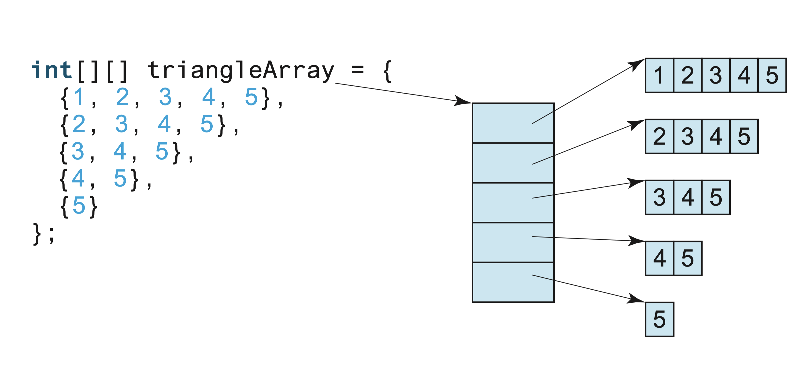

slidenumbers: true
slidecount: true
autoscale: true
slide-transition: true

# Welcome to CS2030S Lab 3!
## 10 September 2021 [16A]

![inline](data:image/png;base64,iVBORw0KGgoAAAANSUhEUgAABHQAAAR0CAYAAAAQDEG2AAAAAXNSR0IArs4c6QAAAARnQU1BAACxjwv8YQUAAAAJcEhZcwAADsMAAA7DAcdvqGQAANNGSURBVHhe7NhBjiTLtSTRv/9Nd884kgQsoEq6lpkcQMZquB5ZJN7//T9JkiRJkiT9U/wPOpIkSZIkSf8Y/4OOJEmSJEnSP8b/oCNJkiRJkvSP8T/oSJIkSZIk/WP8DzqSJEmSJEn/GP+DjiRJkiRJ0j/G/6AjSZIkSZL0j/E/6EiSJEmSJP1j/A86kiRJkiRJ/xj/g44kSZIkSdI/xv+gI0mSJEmS9I/xP+hIkiRJkiT9Y/wPOpIkSZIkSf8Y/4OOJEmSJEnSP8b/oCNJkiRJkvSP8T/oSJIkSZIk/WP8DzqSJEmSJEn/GP+DjiRJkiRJ0j/G/6AjSZIkSZL0j/E/6EiSJEmSJP1j/A86kiRJkiRJ/xj/g44kSZIkSdI/xv+gI0mSJEmS9I/xP+hIkiRJkiT9Y/wPOpIkSZIkSf8Y/4OOJEmSJEnSP8b/oCNJkiRJkvSP8T/oSJIkSZIk/WP8DzqSJEmSJEn/GP+DjiRJkiRJ0j/G/6AjSZIkSZL0j/E/6EiSJEmSJP1j/A86kiRJkiRJ/xj/g44kSZIkSdI/xv+gI0mSJEmS9I/xP+hIkiRJkiT9Y/wPOpIkSZIkSf8Y/4OOJEmSJEnSP8b/oCNJkiRJkvSP8T/oSJIkSZIk/WP8DzqSJEmSJEn/GP+DjiRJkiRJ0j/G/6AjSZIkSZL0j/E/6EiSJEmSJP1j/A86kiRJkiRJ/xj/g44kSZIkSdI/xv+gI0mSJEmS9I/xP+hIkiRJkiT9Y/wPOpIkSZIkSf8Y/4OOJEmSJEnSP8b/oCNJkiRJkvSP8T/oSJIkSZIk/WP8DzqSJEmSJEn/GP+DjiRJkiRJ0j/G/6AjSZIkSZL0j/E/6EiSJEmSJP1j/A86kiRJkiRJ/xj/g44kSZIkSdI/xv+gI0mSJEmS9I/xP+hIkiRJkiT9Y/wPOpIkSZIkSf8Y/4OOJEmSJEnSP8b/oCNJkiRJkvSP8T/oSJIkSZIk/WP8DzqSJEmSJEn/GP+DjiRJkiRJ0j/G/6AjSZIkSZL0j/E/6EiSJEmSJP1j/A86kiRJkiRJ/xj/g44kSZIkSdI/xv+gI0mSJEmS9I/xP+hIkiRJkiT9Y/wPOpIkSZIkSf8Y/4OOJEmSJEnSP8b/oCNJkiRJkvSP8T/oSJIkSZIk/WP8DzqSJEmSJEn/GP+DjiRJkiRJ0j/G/6AjSZIkSZL0j/E/6IT+7//+z+y4Ntqw89bRm5PW0ZuTXkM3SFpHb05aR2+2e1pHb05Shm6a1EYbZn+ljBcM0Y/S7K/aaMPOW0dvTlpHb056Dd0gaR29OWkdvdnuaR29OUkZumlSG22Y/ZUyXjBEP0qzv2qjDTtvHb05aR29Oek1dIOkdfTmpHX0ZrundfTmJGXopklttGH2V8p4wRD9KM3+qo027Lx19OakdfTmpNfQDZLW0ZuT1tGb7Z7W0ZuTlKGbJrXRhtlfKeMFQ/SjNPurNtqw89bRm5PW0ZuTXkM3SFpHb05aR2+2e1pHb05Shm6a1EYbZn+ljBcM0Y/S7K/aaMPOW0dvTlpHb056Dd0gaR29OWkdvdnuaR29OUkZumlSG22Y/ZUyXjBEP0qzv2qjDTtvHb05aR29Oek1dIOkdfTmpHX0ZrundfTmJGXopklttGH2V8p4wRD9KM3+qo027Lx19OakdfTmpNfQDZLW0ZuT1tGb7Z7W0ZuTlKGbJrXRhtlfKeMFQ/SjNPurNtqw89bRm5PW0ZuTXkM3SFpHb05aR2+2e1pHb05Shm6a1EYbZn+ljBcM0Y/S7K/aaMPOW0dvTlpHb056Dd0gaR29OWkdvdnuaR29OUkZumlSG22Y/ZUyXjBEP0qzv2qjDTtvHb05aR29Oek1dIOkdfTmpHX0ZrundfTmJGXopklttGH2V8p4wRD9KM3+qo027Lx19OakdfTmpNfQDZLW0ZuT1tGb7Z7W0ZuTlKGbJrXRhtlfKeMFQ/SjNPurNtqw89bRm5PW0ZuTXkM3SFpHb05aR2+2e1pHb05Shm6a1EYbZn+ljBcM0Y/S7K/aaMPOW0dvTlpHb056Dd0gaR29OWkdvdnuaR29OUkZumlSG22Y/ZUyXjBEP0qzv2qjDTtvHb05aR29Oek1dIOkdfTmpHX0ZrundfTmJGXopklttGH2V8p4wRD9KM3+qo027Lx19OakdfTmpNfQDZLW0ZuT1tGb7Z7W0ZuTlKGbJrXRhtlfKeMFQ/SjNPurNtqw89bRm5PW0ZuTXkM3SFpHb05aR2+2e1pHb05Shm6a1EYbZn+ljBcM0Y/S7K/aaMPOW0dvTlpHb056Dd0gaR29OWkdvdnuaR29OUkZumlSG22Y/ZUyXjBEP0qzv2qjDTtvHb05aR29Oek1dIOkdfTmpHX0ZrundfTmJGXopklttGH2V8p4wRD9KM3+qo027Lx19OakdfTmpNfQDZLW0ZuT1tGb7Z7W0ZuTlKGbJrXRhtlfKeMFQ/SjTNIW+kZJr6EbJLXRxlLr6M123jp6c1Ibbdh56+jNdk9ttGHntdFGkrbQN0pSxguG6EeZpC30jZJeQzdIaqONpdbRm+28dfTmpDbasPPW0Zvtntpow85ro40kbaFvlKSMFwzRjzJJW+gbJb2GbpDURhtLraM323nr6M1JbbRh562jN9s9tdGGnddGG0naQt8oSRkvGKIfZZK20DdKeg3dIKmNNpZaR2+289bRm5PaaMPOW0dvtntqow07r402krSFvlGSMl4wRD/KJG2hb5T0GrpBUhttLLWO3mznraM3J7XRhp23jt5s99RGG3ZeG20kaQt9oyRlvGCIfpRJ2kLfKOk1dIOkNtpYah292c5bR29OaqMNO28dvdnuqY027Lw22kjSFvpGScp4wRD9KJO0hb5R0mvoBklttLHUOnqznbeO3pzURht23jp6s91TG23YeW20kaQt9I2SlPGCIfpRJmkLfaOk19ANktpoY6l19GY7bx29OamNNuy8dfRmu6c22rDz2mgjSVvoGyUp4wVD9KNM0hb6RkmvoRsktdHGUuvozXbeOnpzUhtt2Hnr6M12T220Yee10UaSttA3SlLGC4boR5mkLfSNkl5DN0hqo42l1tGb7bx19OakNtqw89bRm+2e2mjDzmujjSRtoW+UpIwXDNGPMklb6BslvYZukNRGG0utozfbeevozUlttGHnraM32z210Yad10YbSdpC3yhJGS8Yoh9lkrbQN0p6Dd0gqY02llpHb7bz1tGbk9pow85bR2+2e2qjDTuvjTaStIW+UZIyXjBEP8okbaFvlPQaukFSG20stY7ebOetozcntdGGnbeO3mz31EYbdl4bbSRpC32jJGW8YIh+lEnaQt8o6TV0g6Q22lhqHb3ZzltHb05qow07bx292e6pjTbsvDbaSNIW+kZJynjBEP0ok7SFvlHSa+gGSW20sdQ6erOdt47enNRGG3beOnqz3VMbbdh5bbSRpC30jZKU8YIh+lEmaQt9o6TX0A2S2mhjqXX0ZjtvHb05qY027Lx19Ga7pzbasPPaaCNJW+gbJSnjBUP0o0zSFvpGSa+hGyS10cZS6+jNdt46enNSG23YeevozXZPbbRh57XRRpK20DdKUsYLhuhHmaQt9I2SXkM3SGqjjaXW0ZvtvHX05qQ22rDz1tGb7Z7aaMPOa6ONJG2hb5SkjBcM0Y8ySVvoGyW9hm6Q1EYbS62jN9t56+jNSW20YeetozfbPbXRhp3XRhtJ2kLfKEkZLxiiH2WSttA3SnoN3SCpjTaWWkdvtvPW0ZuT2mjDzltHb7Z7aqMNO6+NNpK0hb5RkjJeMEQ/yqQ22ri5NtpIeg3dYKk22khqo42kNtpYah29eSll6KZJbbRh57XRRpIydNOl2mgjqY02bq6NNpKU8YIh+lEmtdHGzbXRRtJr6AZLtdFGUhttJLXRxlLr6M1LKUM3TWqjDTuvjTaSlKGbLtVGG0lttHFzbbSRpIwXDNGPMqmNNm6ujTaSXkM3WKqNNpLaaCOpjTaWWkdvXkoZumlSG23YeW20kaQM3XSpNtpIaqONm2ujjSRlvGCIfpRJbbRxc220kfQausFSbbSR1EYbSW20sdQ6evNSytBNk9pow85ro40kZeimS7XRRlIbbdxcG20kKeMFQ/SjTGqjjZtro42k19ANlmqjjaQ22khqo42l1tGbl1KGbprURht2XhttJClDN12qjTaS2mjj5tpoI0kZLxiiH2VSG23cXBttJL2GbrBUG20ktdFGUhttLLWO3ryUMnTTpDbasPPaaCNJGbrpUm20kdRGGzfXRhtJynjBEP0ok9po4+baaCPpNXSDpdpoI6mNNpLaaGOpdfTmpZShmya10Yad10YbScrQTZdqo42kNtq4uTbaSFLGC4boR5nURhs310YbSa+hGyzVRhtJbbSR1EYbS62jNy+lDN00qY027Lw22khShm66VBttJLXRxs210UaSMl4wRD/KpDbauLk22kh6Dd1gqTbaSGqjjaQ22lhqHb15KWXopklttGHntdFGkjJ006XaaCOpjTZuro02kpTxgiH6USa10cbNtdFG0mvoBku10UZSG20ktdHGUuvozUspQzdNaqMNO6+NNpKUoZsu1UYbSW20cXNttJGkjBcM0Y8yqY02bq6NNpJeQzdYqo02ktpoI6mNNpZaR29eShm6aVIbbdh5bbSRpAzddKk22khqo42ba6ONJGW8YIh+lElttHFzbbSR9Bq6wVJttJHURhtJbbSx1Dp681LK0E2T2mjDzmujjSRl6KZLtdFGUhtt3FwbbSQp4wVD9KNMaqONm2ujjaTX0A2WaqONpDbaSGqjjaXW0ZuXUoZumtRGG3ZeG20kKUM3XaqNNpLaaOPm2mgjSRkvGKIfZVIbbdxcG20kvYZusFQbbSS10UZSG20stY7evJQydNOkNtqw89poI0kZuulSbbSR1EYbN9dGG0nKeMEQ/SiT2mjj5tpoI+k1dIOl2mgjqY02ktpoY6l19OallKGbJrXRhp3XRhtJytBNl2qjjaQ22ri5NtpIUsYLhuhHmdRGGzfXRhtJr6EbLNVGG0lttJHURhtLraM3L6UM3TSpjTbsvDbaSFKGbrpUG20ktdHGzbXRRpIyXjBEP8qkNtq4uTbaSHoN3WCpNtpIaqONpDbaWGodvXkpZeimSW20Yee10UaSMnTTpdpoI6mNNm6ujTaSlPGCIfpRJrXRxs210UbSa+gGS7XRRlIbbSS10cZS6+jNSylDN01qow07r402kpShmy7VRhtJbbRxc220kaSMFwzRjzKpjTZuro02kl5DN1iqjTaS2mgjqY02llpHb15KGbppUhtt2HlttJGkDN10qTbaSGqjjZtro40kZbxgiH6USW20cXNttJH0GrrBUm20kdRGG0lttLHUOnrzUsrQTZPaaMPOa6ONJGXopku10UZSG23cXBttJCnjBUP0o0xqo42ba6ONpHX05qR19Oak19ANlmqjjaQ22ri5NtpYqo02ktpoY6nX0A2WWkdvTlpHb05qo42ba6ONJGW8YIh+lElttHFzbbSRtI7enLSO3pz0GrrBUm20kdRGGzfXRhtLtdFGUhttLPUausFS6+jNSevozUlttHFzbbSRpIwXDNGPMqmNNm6ujTaS1tGbk9bRm5NeQzdYqo02ktpo4+baaGOpNtpIaqONpV5DN1hqHb05aR29OamNNm6ujTaSlPGCIfpRJrXRxs210UbSOnpz0jp6c9Jr6AZLtdFGUhtt3FwbbSzVRhtJbbSx1GvoBkutozcnraM3J7XRxs210UaSMl4wRD/KpDbauLk22khaR29OWkdvTnoN3WCpNtpIaqONm2ujjaXaaCOpjTaWeg3dYKl19OakdfTmpDbauLk22khSxguG6EeZ1EYbN9dGG0nr6M1J6+jNSa+hGyzVRhtJbbRxc220sVQbbSS10cZSr6EbLLWO3py0jt6c1EYbN9dGG0nKeMEQ/SiT2mjj5tpoI2kdvTlpHb056TV0g6XaaCOpjTZuro02lmqjjaQ22ljqNXSDpdbRm5PW0ZuT2mjj5tpoI0kZLxiiH2VSG23cXBttJK2jNyetozcnvYZusFQbbSS10cbNtdHGUm20kdRGG0u9hm6w1Dp6c9I6enNSG23cXBttJCnjBUP0o0xqo42ba6ONpHX05qR19Oak19ANlmqjjaQ22ri5NtpYqo02ktpoY6nX0A2WWkdvTlpHb05qo42ba6ONJGW8YIh+lElttHFzbbSRtI7enLSO3pz0GrrBUm20kdRGGzfXRhtLtdFGUhttLPUausFS6+jNSevozUlttHFzbbSRpIwXDNGPMqmNNm6ujTaS1tGbk9bRm5NeQzdYqo02ktpo4+baaGOpNtpIaqONpV5DN1hqHb05aR29OamNNm6ujTaSlPGCIfpRJrXRxs210UbSOnpz0jp6c9Jr6AZLtdFGUhtt3FwbbSzVRhtJbbSx1GvoBkutozcnraM3J7XRxs210UaSMl4wRD/KpDbauLk22khaR29OWkdvTnoN3WCpNtpIaqONm2ujjaXaaCOpjTaWeg3dYKl19OakdfTmpDbauLk22khSxguG6EeZ1EYbN9dGG0nr6M1J6+jNSa+hGyzVRhtJbbRxc220sVQbbSS10cZSr6EbLLWO3py0jt6c1EYbN9dGG0nKeMEQ/SiT2mjj5tpoI2kdvTlpHb056TV0g6XaaCOpjTZuro02lmqjjaQ22ljqNXSDpdbRm5PW0ZuT2mjj5tpoI0kZLxiiH2VSG23cXBttJK2jNyetozcnvYZusFQbbSS10cbNtdHGUm20kdRGG0u9hm6w1Dp6c9I6enNSG23cXBttJCnjBUP0o0xqo42ba6ONpHX05qR19Oak19ANlmqjjaQ22ri5NtpYqo02ktpoY6nX0A2WWkdvTlpHb05qo42ba6ONJGW8YIh+lElttHFzbbSRtI7enLSO3pz0GrrBUm20kdRGGzfXRhtLtdFGUhttLPUausFS6+jNSevozUlttHFzbbSRpIwXDNGPMqmNNm6ujTaS1tGbk9bRm5NeQzdYqo02ktpo4+baaGOpNtpIaqONpV5DN1hqHb05aR29OamNNm6ujTaSlPGCIfpRJrXRxs210UbSOnpz0jp6c9Jr6AZLtdFGUhtt3FwbbSzVRhtJbbSx1GvoBkutozcnraM3J7XRxs210UaSMl4wRD/KpDbauLk22khqo42kdfTmpdbRm5PaaGOpNtpIaqMN+6519OaldDf65knK0E2T2mjj5tpoI0kZLxiiH2VSG23cXBttJLXRRtI6evNS6+jNSW20sVQbbSS10YZ91zp681K6G33zJGXopklttHFzbbSRpIwXDNGPMqmNNm6ujTaS2mgjaR29eal19OakNtpYqo02ktpow75rHb15Kd2NvnmSMnTTpDbauLk22khSxguG6EeZ1EYbN9dGG0lttJG0jt681Dp6c1IbbSzVRhtJbbRh37WO3ryU7kbfPEkZumlSG23cXBttJCnjBUP0o0xqo42ba6ONpDbaSFpHb15qHb05qY02lmqjjaQ22rDvWkdvXkp3o2+epAzdNKmNNm6ujTaSlPGCIfpRJrXRxs210UZSG20kraM3L7WO3pzURhtLtdFGUhtt2HetozcvpbvRN09Shm6a1EYbN9dGG0nKeMEQ/SiT2mjj5tpoI6mNNpLW0ZuXWkdvTmqjjaXaaCOpjTbsu9bRm5fS3eibJylDN01qo42ba6ONJGW8YIh+lElttHFzbbSR1EYbSevozUutozcntdHGUm20kdRGG/Zd6+jNS+lu9M2TlKGbJrXRxs210UaSMl4wRD/KpDbauLk22khqo42kdfTmpdbRm5PaaGOpNtpIaqMN+6519OaldDf65knK0E2T2mjj5tpoI0kZLxiiH2VSG23cXBttJLXRRtI6evNS6+jNSW20sVQbbSS10YZ91zp681K6G33zJGXopklttHFzbbSRpIwXDNGPMqmNNm6ujTaS2mgjaR29eal19OakNtpYqo02ktpow75rHb15Kd2NvnmSMnTTpDbauLk22khSxguG6EeZ1EYbN9dGG0lttJG0jt681Dp6c1IbbSzVRhtJbbRh37WO3ryU7kbfPEkZumlSG23cXBttJCnjBUP0o0xqo42ba6ONpDbaSFpHb15qHb05qY02lmqjjaQ22rDvWkdvXkp3o2+epAzdNKmNNm6ujTaSlPGCIfpRJrXRxs210UZSG20kraM3L7WO3pzURhtLtdFGUhtt2HetozcvpbvRN09Shm6a1EYbN9dGG0nKeMEQ/SiT2mjj5tpoI6mNNpLW0ZuXWkdvTmqjjaXaaCOpjTbsu9bRm5fS3eibJylDN01qo42ba6ONJGW8YIh+lElttHFzbbSR1EYbSevozUutozcntdHGUm20kdRGG/Zd6+jNS+lu9M2TlKGbJrXRxs210UaSMl4wRD/KpDbauLk22khqo42kdfTmpdbRm5PaaGOpNtpIaqMN+6519OaldDf65knK0E2T2mjj5tpoI0kZLxiiH2VSG23cXBttJLXRRtI6evNS6+jNSW20sVQbbSS10YZ91zp681K6G33zJGXopklttHFzbbSRpIwXDNGPMqmNNm6ujTaS2mgjaR29eal19OakNtpYqo02ktpow75rHb15Kd2NvnmSMnTTpDbauLk22khSxguG6EeZ1EYbN9dGG0lttJG0jt681Dp6c1IbbSzVRhtJbbRh37WO3ryU7kbfPEkZumlSG23cXBttJCnjBUP0o0zSFvpGSW20kaQt9I3svNfQDZZ6Dd0gqY02krSFvtFS6+jNSa+hGyRpC32jJGW8YIh+lEnaQt8oqY02krSFvpGd9xq6wVKvoRsktdFGkrbQN1pqHb056TV0gyRtoW+UpIwXDNGPMklb6BsltdFGkrbQN7LzXkM3WOo1dIOkNtpI0hb6RkutozcnvYZukKQt9I2SlPGCIfpRJmkLfaOkNtpI0hb6Rnbea+gGS72GbpDURhtJ2kLfaKl19Oak19ANkrSFvlGSMl4wRD/KJG2hb5TURhtJ2kLfyM57Dd1gqdfQDZLaaCNJW+gbLbWO3pz0GrpBkrbQN0pSxguG6EeZpC30jZLaaCNJW+gb2XmvoRss9Rq6QVIbbSRpC32jpdbRm5NeQzdI0hb6RknKeMEQ/SiTtIW+UVIbbSRpC30jO+81dIOlXkM3SGqjjSRtoW+01Dp6c9Jr6AZJ2kLfKEkZLxiiH2WSttA3SmqjjSRtoW9k572GbrDUa+gGSW20kaQt9I2WWkdvTnoN3SBJW+gbJSnjBUP0o0zSFvpGSW20kaQt9I3svNfQDZZ6Dd0gqY02krSFvtFS6+jNSa+hGyRpC32jJGW8YIh+lEnaQt8oqY02krSFvpGd9xq6wVKvoRsktdFGkrbQN1pqHb056TV0gyRtoW+UpIwXDNGPMklb6BsltdFGkrbQN7LzXkM3WOo1dIOkNtpI0hb6RkutozcnvYZukKQt9I2SlPGCIfpRJmkLfaOkNtpI0hb6Rnbea+gGS72GbpDURhtJ2kLfaKl19Oak19ANkrSFvlGSMl4wRD/KJG2hb5TURhtJ2kLfyM57Dd1gqdfQDZLaaCNJW+gbLbWO3pz0GrpBkrbQN0pSxguG6EeZpC30jZLaaCNJW+gb2XmvoRss9Rq6QVIbbSRpC32jpdbRm5NeQzdI0hb6RknKeMEQ/SiTtIW+UVIbbSRpC30jO+81dIOlXkM3SGqjjSRtoW+01Dp6c9Jr6AZJ2kLfKEkZLxiiH2WSttA3SmqjjSRtoW9k572GbrDUa+gGSW20kaQt9I2WWkdvTnoN3SBJW+gbJSnjBUP0o0zSFvpGSW20kaQt9I3svNfQDZZ6Dd0gqY02krSFvtFS6+jNSa+hGyRpC32jJGW8YIh+lEnaQt8oqY02krSFvpGd9xq6wVKvoRsktdFGkrbQN1pqHb056TV0gyRtoW+UpIwXDNGPMklb6BsltdFGkrbQN7LzXkM3WOo1dIOkNtpI0hb6RkutozcnvYZukKQt9I2SlPGCIfpRJmkLfaOkNtpI0hb6Rnbea+gGS72GbpDURhtJ2kLfaKl19Oak19ANkrSFvlGSMl4wRD9Ks79qo42kNtpIaqONpDbaSGqjjaQ22khqo42kNtpIaqONpDbaSGqjjaQ22khqo42kNtpIaqONpDbaSGqjjaQ22jD7K2W8YIh+lGZ/1UYbSW20kdRGG0lttJHURhtJbbSR1EYbSW20kdRGG0lttJHURhtJbbSR1EYbSW20kdRGG0lttJHURhtJbbRh9lfKeMEQ/SjN/qqNNpLaaCOpjTaS2mgjqY02ktpoI6mNNpLaaCOpjTaS2mgjqY02ktpoI6mNNpLaaCOpjTaS2mgjqY02ktpow+yvlPGCIfpRmv1VG20ktdFGUhttJLXRRlIbbSS10UZSG20ktdFGUhttJLXRRlIbbSS10UZSG20ktdFGUhttJLXRRlIbbSS10YbZXynjBUP0ozT7qzbaSGqjjaQ22khqo42kNtpIaqONpDbaSGqjjaQ22khqo42kNtpIaqONpDbaSGqjjaQ22khqo42kNtpIaqMNs79SxguG6Edp9ldttJHURhtJbbSR1EYbSW20kdRGG0lttJHURhtJbbSR1EYbSW20kdRGG0lttJHURhtJbbSR1EYbSW20kdRGG2Z/pYwXDNGP0uyv2mgjqY02ktpoI6mNNpLaaCOpjTaS2mgjqY02ktpoI6mNNpLaaCOpjTaS2mgjqY02ktpoI6mNNpLaaCOpjTbM/koZLxiiH6XZX7XRRlIbbSS10UZSG20ktdFGUhttJLXRRlIbbSS10UZSG20ktdFGUhttJLXRRlIbbSS10UZSG20ktdFGUhttmP2VMl4wRD9Ks79qo42kNtpIaqONpDbaSGqjjaQ22khqo42kNtpIaqONpDbaSGqjjaQ22khqo42kNtpIaqONpDbaSGqjjaQ22jD7K2W8YIh+lGZ/1UYbSW20kdRGG0lttJHURhtJbbSR1EYbSW20kdRGG0lttJHURhtJbbSR1EYbSW20kdRGG0lttJHURhtJbbRh9lfKeMEQ/SjN/qqNNpLaaCOpjTaS2mgjqY02ktpoI6mNNpLaaCOpjTaS2mgjqY02ktpoI6mNNpLaaCOpjTaS2mgjqY02ktpow+yvlPGCIfpRmv1VG20ktdFGUhttJLXRRlIbbSS10UZSG20ktdFGUhttJLXRRlIbbSS10UZSG20ktdFGUhttJLXRRlIbbSS10YbZXynjBUP0ozT7qzbaSGqjjaQ22khqo42kNtpIaqONpDbaSGqjjaQ22khqo42kNtpIaqONpDbaSGqjjaQ22khqo42kNtpIaqMNs79SxguG6Edp9ldttJHURhtJbbSR1EYbSW20kdRGG0lttJHURhtJbbSR1EYbSW20kdRGG0lttJHURhtJbbSR1EYbSW20kdRGG2Z/pYwXDNGP0uyv2mgjqY02ktpoI6mNNpLaaCOpjTaS2mgjqY02ktpoI6mNNpLaaCOpjTaS2mgjqY02ktpoI6mNNpLaaCOpjTbM/koZLxiiH6XZX7XRRlIbbSS10UZSG20ktdFGUhttJLXRRlIbbSS10UZSG20ktdFGUhttJLXRRlIbbSS10UZSG20ktdFGUhttmP2VMl4wRD9Ks79qo42kNtpIaqONpDbaSGqjjaQ22khqo42kNtpIaqONpDbaSGqjjaQ22khqo42kNtpIaqONpDbaSGqjjaQ22jD7K2W8YIh+lGZ/1UYbSW20kdRGG0lttJHURhtJbbSR1EYbSW20kdRGG0lttJHURhtJbbSR1EYbSW20kdRGG0lttJHURhtJbbRh9lfKeMEQ/SjN/qqNNpLaaCOpjTaS2mgjqY02ktpoI6mNNpLaaCOpjTaS2mgjqY02ktpoI6mNNpLaaCOpjTaS2mgjqY02ktpow+yvlPGCIfpRmv1VG20ktdFGUhttJLXRRlIbbSS10UZSG20ktdFGUhttJLXRRlIbbSS10UZSG20ktdFGUhttJLXRRlIbbSS10YbZXynjBSX9B/0jm9RGG0nK0E2T2mgj6TV0g6TX0A2WaqONpdbRm5PW0ZtvTpL+W/wXRtJ/0P8JSWqjjSRl6KZJbbSR9Bq6QdJr6AZLtdHGUuvozUnr6M03J0n/Lf4LI+k/6P+EJLXRRpIydNOkNtpIeg3dIOk1dIOl2mhjqXX05qR19Oabk6T/Fv+FkfQf9H9CktpoI0kZumlSG20kvYZukPQausFSbbSx1Dp6c9I6evPNSdJ/i//CSPoP+j8hSW20kaQM3TSpjTaSXkM3SHoN3WCpNtpYah29OWkdvfnmJOm/xX9hJP0H/Z+QpDbaSFKGbprURhtJr6EbJL2GbrBUG20stY7enLSO3nxzkvTf4r8wkv6D/k9IUhttJClDN01qo42k19ANkl5DN1iqjTaWWkdvTlpHb745Sfpv8V8YSf9B/yckqY02kpShmya10UbSa+gGSa+hGyzVRhtLraM3J62jN9+cJP23+C+MpP+g/xOS1EYbScrQTZPaaCPpNXSDpNfQDZZqo42l1tGbk9bRm29Okv5b/BdG0n/Q/wlJaqONJGXopklttJH0GrpB0mvoBku10cZS6+jNSevozTcnSf8t/gsj6T/o/4QktdFGkjJ006Q22kh6Dd0g6TV0g6XaaGOpdfTmpHX05puTpP8W/4WR9B/0f0KS2mgjSRm6aVIbbSS9hm6Q9Bq6wVJttLHUOnpz0jp6881J0n+L/8JI+g/6PyFJbbSRpAzdNKmNNpJeQzdIeg3dYKk22lhqHb05aR29+eYk6b/Ff2Ek/Qf9n5CkNtpIUoZumtRGG0mvoRskvYZusFQbbSy1jt6ctI7efHOS9N/ivzCS/oP+T0hSG20kKUM3TWqjjaTX0A2SXkM3WKqNNpZaR29OWkdvvjlJ+m/xXxhJ/0H/JySpjTaSlKGbJrXRRtJr6AZJr6EbLNVGG0utozcnraM335wk/bf4L4yk/6D/E5LURhtJytBNk9poI+k1dIOk19ANlmqjjaXW0ZuT1tGbb06S/lv8F0bSf9D/CUlqo40kZeimSW20kfQaukHSa+gGS7XRxlLr6M1J6+jNNydJ/y3+CyPpP+j/hCS10UaSMnTTpDbaSHoN3SDpNXSDpdpoY6l19OakdfTmm5Ok/xb/hZH0H/R/QpLaaCNJGbppUhttJL2GbpD0GrrBUm20sdQ6enPSOnrzzUnSf4v/woyh/xEw+6s22khqow07r402ktpoI2kdvdnuqY027LvaaGOpNtqw89bRm5d6Dd0gSRkvOIZ+5GZ/1UYbSW20Yee10UZSG20kraM32z210YZ9VxttLNVGG3beOnrzUq+hGyQp4wXH0I/c7K/aaCOpjTbsvDbaSGqjjaR19Ga7pzbasO9qo42l2mjDzltHb17qNXSDJGW84Bj6kZv9VRttJLXRhp3XRhtJbbSRtI7ebPfURhv2XW20sVQbbdh56+jNS72GbpCkjBccQz9ys79qo42kNtqw89poI6mNNpLW0Zvtntpow76rjTaWaqMNO28dvXmp19ANkpTxgmPoR272V220kdRGG3ZeG20ktdFG0jp6s91TG23Yd7XRxlJttGHnraM3L/UaukGSMl5wDP3Izf6qjTaS2mjDzmujjaQ22khaR2+2e2qjDfuuNtpYqo027Lx19OalXkM3SFLGC46hH7nZX7XRRlIbbdh5bbSR1EYbSevozXZPbbRh39VGG0u10Yadt47evNRr6AZJynjBMfQjN/urNtpIaqMNO6+NNpLaaCNpHb3Z7qmNNuy72mhjqTbasPPW0ZuXeg3dIEkZLziGfuRmf9VGG0lttGHntdFGUhttJK2jN9s9tdGGfVcbbSzVRht23jp681KvoRskKeMFx9CP3Oyv2mgjqY027Lw22khqo42kdfRmu6c22rDvaqONpdpow85bR29e6jV0gyRlvOAY+pGb/VUbbSS10Yad10YbSW20kbSO3mz31EYb9l1ttLFUG23YeevozUu9hm6QpIwXHEM/crO/aqONpDbasPPaaCOpjTaS1tGb7Z7aaMO+q402lmqjDTtvHb15qdfQDZKU8YJj6Edu9ldttJHURht2XhttJLXRRtI6erPdUxtt2He10cZSbbRh562jNy/1GrpBkjJecAz9yM3+qo02ktpow85ro42kNtpIWkdvtntqow37rjbaWKqNNuy8dfTmpV5DN0hSxguOoR+52V+10UZSG23YeW20kdRGG0nr6M12T220Yd/VRhtLtdGGnbeO3rzUa+gGScp4wTH0Izf7qzbaSGqjDTuvjTaS2mgjaR292e6pjTbsu9poY6k22rDz1tGbl3oN3SBJGS84hn7kZn/VRhtJbbRh57XRRlIbbSStozfbPbXRhn1XG20s1UYbdt46evNSr6EbJCnjBcfQj9zsr9poI6mNNuy8NtpIaqONpHX0ZrunNtqw72qjjaXaaMPOW0dvXuo1dIMkZbzgGPqRm/1VG20ktdGGnddGG0lttJG0jt5s99RGG/ZdbbSxVBtt2Hnr6M1LvYZukKSMF9RP6I9wKWXopku10UZSG20ktdHGUm20kbSO3rzUOnrzzbXRRlIbbSQpQzdNaqONpDbasPPaaGMpbfGL6Cf0R72UMnTTpdpoI6mNNpLaaGOpNtpIWkdvXmodvfnm2mgjqY02kpShmya10UZSG23YeW20sZS2+EX0E/qjXkoZuulSbbSR1EYbSW20sVQbbSStozcvtY7efHNttJHURhtJytBNk9poI6mNNuy8NtpYSlv8IvoJ/VEvpQzddKk22khqo42kNtpYqo02ktbRm5daR2++uTbaSGqjjSRl6KZJbbSR1EYbdl4bbSylLX4R/YT+qJdShm66VBttJLXRRlIbbSzVRhtJ6+jNS62jN99cG20ktdFGkjJ006Q22khqow07r402ltIWv4h+Qn/USylDN12qjTaS2mgjqY02lmqjjaR19Oal1tGbb66NNpLaaCNJGbppUhttJLXRhp3XRhtLaYtfRD+hP+qllKGbLtVGG0lttJHURhtLtdFG0jp681Lr6M0310YbSW20kaQM3TSpjTaS2mjDzmujjaW0xS+in9Af9VLK0E2XaqONpDbaSGqjjaXaaCNpHb15qXX05ptro42kNtpIUoZumtRGG0lttGHntdHGUtriF9FP6I96KWXopku10UZSG20ktdHGUm20kbSO3rzUOnrzzbXRRlIbbSQpQzdNaqONpDbasPPaaGMpbfGL6Cf0R72UMnTTpdpoI6mNNpLaaGOpNtpIWkdvXmodvfnm2mgjqY02kpShmya10UZSG23YeW20sZS2+EX0E/qjXkoZuulSbbSR1EYbSW20sVQbbSStozcvtY7efHNttJHURhtJytBNk9poI6mNNuy8NtpYSlv8IvoJ/VEvpQzddKk22khqo42kNtpYqo02ktbRm5daR2++uTbaSGqjjSRl6KZJbbSR1EYbdl4bbSylLX4R/YT+qJdShm66VBttJLXRRlIbbSzVRhtJ6+jNS62jN99cG20ktdFGkjJ006Q22khqow07r402ltIWv4h+Qn/USylDN12qjTaS2mgjqY02lmqjjaR19Oal1tGbb66NNpLaaCNJGbppUhttJLXRhp3XRhtLaYtfRD+hP+qllKGbLtVGG0lttJHURhtLtdFG0jp681Lr6M0310YbSW20kaQM3TSpjTaS2mjDzmujjaW0xS+in9Af9VLK0E2XaqONpDbaSGqjjaXaaCNpHb15qXX05ptro42kNtpIUoZumtRGG0lttGHntdHGUtriF9FP6I96KWXopku10UZSG20ktdHGUm20kbSO3rzUOnrzzbXRRlIbbSQpQzdNaqONpDbasPPaaGMpbfGL6Cf0R72UMnTTpdpoI6mNNpLaaGOpNtpIWkdvXmodvfnm2mgjqY02kpShmya10UZSG23YeW20sZS2+EX0E/qjXkoZuulSbbSR1EYbSW20sVQbbSStozcvtY7efHNttJHURhtJytBNk9poI6mNNuy8NtpYSlv8IvoJ/VEvpQzddKk22khqo42kNtpYqo02ktbRm5daR2++uTbaSGqjjSRl6KZJbbSR1EYbdl4bbSylLX6RMfRHs9Q6evPNtdHGUsrQTZPaaGMp6Rf0G0pqo42l2mjDvmsdvTlpHb05SVvoGy2ljBccQz/ypdbRm2+ujTaWUoZumtRGG0tJv6DfUFIbbSzVRhv2XevozUnr6M1J2kLfaCllvOAY+pEvtY7efHNttLGUMnTTpDbaWEr6Bf2GktpoY6k22rDvWkdvTlpHb07SFvpGSynjBcfQj3ypdfTmm2ujjaWUoZsmtdHGUtIv6DeU1EYbS7XRhn3XOnpz0jp6c5K20DdaShkvOIZ+5EutozffXBttLKUM3TSpjTaWkn5Bv6GkNtpYqo027LvW0ZuT1tGbk7SFvtFSynjBMfQjX2odvfnm2mhjKWXopklttLGU9Av6DSW10cZSbbRh37WO3py0jt6cpC30jZZSxguOoR/5UuvozTfXRhtLKUM3TWqjjaWkX9BvKKmNNpZqow37rnX05qR19OYkbaFvtJQyXnAM/ciXWkdvvrk22lhKGbppUhttLCX9gn5DSW20sVQbbdh3raM3J62jNydpC32jpZTxgmPoR77UOnrzzbXRxlLK0E2T2mhjKekX9BtKaqONpdpow75rHb05aR29OUlb6BstpYwXHEM/8qXW0Ztvro02llKGbprURhtLSb+g31BSG20s1UYb9l3r6M1J6+jNSdpC32gpZbzgGPqRL7WO3nxzbbSxlDJ006Q22lhK+gX9hpLaaGOpNtqw71pHb05aR29O0hb6Rksp4wXH0I98qXX05ptro42llKGbJrXRxlLSL+g3lNRGG0u10YZ91zp6c9I6enOSttA3WkoZLziGfuRLraM331wbbSylDN00qY02lpJ+Qb+hpDbaWKqNNuy71tGbk9bRm5O0hb7RUsp4wTH0I19qHb355tpoYyll6KZJbbSxlPQL+g0ltdHGUm20Yd+1jt6ctI7enKQt9I2WUsYLjqEf+VLr6M0310YbSylDN01qo42lpF/QbyipjTaWaqMN+6519OakdfTmJG2hb7SUMl5wDP3Il1pHb765NtpYShm6aVIbbSwl/YJ+Q0lttLFUG23Yd62jNyetozcnaQt9o6WU8YJj6Ee+1Dp688210cZSytBNk9poYynpF/QbSmqjjaXaaMO+ax29OWkdvTlJW+gbLaWMFxxDP/Kl1tGbb66NNpZShm6a1EYbS0m/oN9QUhttLNVGG/Zd6+jNSevozUnaQt9oKWW84Bj6kS+1jt58c220sZQydNOkNtpYSvoF/YaS2mhjqTbasO9aR29OWkdvTtIW+kZLKeMFx9CPfKl19Oaba6ONpZShmya10cZS0i/oN5TURhtLtdGGfdc6enPSOnpzkrbQN1pKGS84hn7k9l2voRsktdGGfddr6AZ2XhttJGkLfaOba6ONpHX05iRl6KZJbbSxVBttJGmLX2QM/dHYd72GbpDURhv2Xa+hG9h5bbSRpC30jW6ujTaS1tGbk5Shmya10cZSbbSRpC1+kTH0R2Pf9Rq6QVIbbdh3vYZuYOe10UaSttA3urk22khaR29OUoZumtRGG0u10UaStvhFxtAfjX3Xa+gGSW20Yd/1GrqBnddGG0naQt/o5tpoI2kdvTlJGbppUhttLNVGG0na4hcZQ3809l2voRsktdGGfddr6AZ2XhttJGkLfaOba6ONpHX05iRl6KZJbbSxVBttJGmLX2QM/dHYd72GbpDURhv2Xa+hG9h5bbSRpC30jW6ujTaS1tGbk5Shmya10cZSbbSRpC1+kTH0R2Pf9Rq6QVIbbdh3vYZuYOe10UaSttA3urk22khaR29OUoZumtRGG0u10UaStvhFxtAfjX3Xa+gGSW20Yd/1GrqBnddGG0naQt/o5tpoI2kdvTlJGbppUhttLNVGG0na4hcZQ3809l2voRsktdGGfddr6AZ2XhttJGkLfaOba6ONpHX05iRl6KZJbbSxVBttJGmLX2QM/dHYd72GbpDURhv2Xa+hG9h5bbSRpC30jW6ujTaS1tGbk5Shmya10cZSbbSRpC1+kTH0R2Pf9Rq6QVIbbdh3vYZuYOe10UaSttA3urk22khaR29OUoZumtRGG0u10UaStvhFxtAfjX3Xa+gGSW20Yd/1GrqBnddGG0naQt/o5tpoI2kdvTlJGbppUhttLNVGG0na4hcZQ3809l2voRsktdGGfddr6AZ2XhttJGkLfaOba6ONpHX05iRl6KZJbbSxVBttJGmLX2QM/dHYd72GbpDURhv2Xa+hG9h5bbSRpC30jW6ujTaS1tGbk5Shmya10cZSbbSRpC1+kTH0R2Pf9Rq6QVIbbdh3vYZuYOe10UaSttA3urk22khaR29OUoZumtRGG0u10UaStvhFxtAfjX3Xa+gGSW20Yd/1GrqBnddGG0naQt/o5tpoI2kdvTlJGbppUhttLNVGG0na4hcZQ3809l2voRsktdGGfddr6AZ2XhttJGkLfaOba6ONpHX05iRl6KZJbbSxVBttJGmLX2QM/dHYd72GbpDURhv2Xa+hG9h5bbSRpC30jW6ujTaS1tGbk5Shmya10cZSbbSRpC1+kTH0R2Pf9Rq6QVIbbdh3vYZuYOe10UaSttA3urk22khaR29OUoZumtRGG0u10UaStvhFxtAfjX3Xa+gGSW20Yd/1GrqBnddGG0naQt/o5tpoI2kdvTlJGbppUhttLNVGG0na4hcJ0Y98qTbaWKqNNpZaR2++uTbaWEoZumlSG20kraM339w6enOSttA3SlpHb7bvWkdvXkpb/CIh+pEv1UYbS7XRxlLr6M0310YbSylDN01qo42kdfTmm1tHb07SFvpGSevozfZd6+jNS2mLXyREP/Kl2mhjqTbaWGodvfnm2mhjKWXopklttJG0jt58c+vozUnaQt8oaR292b5rHb15KW3xi4ToR75UG20s1UYbS62jN99cG20spQzdNKmNNpLW0Ztvbh29OUlb6BslraM323etozcvpS1+kRD9yJdqo42l2mhjqXX05ptro42llKGbJrXRRtI6evPNraM3J2kLfaOkdfRm+6519OaltMUvEqIf+VJttLFUG20stY7efHNttLGUMnTTpDbaSFpHb765dfTmJG2hb5S0jt5s37WO3ryUtvhFQvQjX6qNNpZqo42l1tGbb66NNpZShm6a1EYbSevozTe3jt6cpC30jZLW0Zvtu9bRm5fSFr9IiH7kS7XRxlJttLHUOnrzzbXRxlLK0E2T2mgjaR29+ebW0ZuTtIW+UdI6erN91zp681La4hcJ0Y98qTbaWKqNNpZaR2++uTbaWEoZumlSG20kraM339w6enOSttA3SlpHb7bvWkdvXkpb/CIh+pEv1UYbS7XRxlLr6M0310YbSylDN01qo42kdfTmm1tHb07SFvpGSevozfZd6+jNS2mLXyREP/Kl2mhjqTbaWGodvfnm2mhjKWXopklttJG0jt58c+vozUnaQt8oaR292b5rHb15KW3xi4ToR75UG20s1UYbS62jN99cG20spQzdNKmNNpLW0Ztvbh29OUlb6BslraM323etozcvpS1+kRD9yJdqo42l2mhjqXX05ptro42llKGbJrXRRtI6evPNraM3J2kLfaOkdfRm+6519OaltMUvEqIf+VJttLFUG20stY7efHNttLGUMnTTpDbaSFpHb765dfTmJG2hb5S0jt5s37WO3ryUtvhFQvQjX6qNNpZqo42l1tGbb66NNpZShm6a1EYbSevozTe3jt6cpC30jZLW0Zvtu9bRm5fSFr9IiH7kS7XRxlJttLHUOnrzzbXRxlLK0E2T2mgjaR29+ebW0ZuTtIW+UdI6erN91zp681La4hcJ0Y98qTbaWKqNNpZaR2++uTbaWEoZumlSG20kraM339w6enOSttA3SlpHb7bvWkdvXkpb/CIh+pEv1UYbS7XRxlLr6M0310YbSylDN01qo42kdfTmm1tHb07SFvpGSevozfZd6+jNS2mLXyREP/Kl2mhjqTbaWGodvfnm2mhjKWXopklttJG0jt58c+vozUnaQt8oaR292b5rHb15KW3xi4ToR75UG20s1UYbS62jN99cG20spQzdNKmNNpLW0Ztvbh29OUlb6BslraM323etozcvpS1+Ef2E/qiXeg3dIEn6Bf2GktpoYyltoW+U1EYbS7XRRlIbbSStozcntdFGUhttJK2jNy/VRhtL6W5+Yf2E/pFY6jV0gyTpF/QbSmqjjaW0hb5RUhttLNVGG0lttJG0jt6c1EYbSW20kbSO3rxUG20spbv5hfUT+kdiqdfQDZKkX9BvKKmNNpbSFvpGSW20sVQbbSS10UbSOnpzUhttJLXRRtI6evNSbbSxlO7mF9ZP6B+JpV5DN0iSfkG/oaQ22lhKW+gbJbXRxlJttJHURhtJ6+jNSW20kdRGG0nr6M1LtdHGUrqbX1g/oX8klnoN3SBJ+gX9hpLaaGMpbaFvlNRGG0u10UZSG20kraM3J7XRRlIbbSStozcv1UYbS+lufmH9hP6RWOo1dIMk6Rf0G0pqo42ltIW+UVIbbSzVRhtJbbSRtI7enNRGG0lttJG0jt68VBttLKW7+YX1E/pHYqnX0A2SpF/QbyipjTaW0hb6RklttLFUG20ktdFG0jp6c1IbbSS10UbSOnrzUm20sZTu5hfWT+gfiaVeQzdIkn5Bv6GkNtpYSlvoGyW10cZSbbSR1EYbSevozUlttJHURhtJ6+jNS7XRxlK6m19YP6F/JJZ6Dd0gSfoF/YaS2mhjKW2hb5TURhtLtdFGUhttJK2jNye10UZSG20kraM3L9VGG0vpbn5h/YT+kVjqNXSDJOkX9BtKaqONpbSFvlFSG20s1UYbSW20kbSO3pzURhtJbbSRtI7evFQbbSylu/mF9RP6R2Kp19ANkqRf0G8oqY02ltIW+kZJbbSxVBttJLXRRtI6enNSG20ktdFG0jp681JttLGU7uYX1k/oH4mlXkM3SJJ+Qb+hpDbaWEpb6BsltdHGUm20kdRGG0nr6M1JbbSR1EYbSevozUu10cZSuptfWD+hfySWeg3dIEn6Bf2GktpoYyltoW+U1EYbS7XRRlIbbSStozcntdFGUhttJK2jNy/VRhtL6W5+Yf2E/pFY6jV0gyTpF/QbSmqjjaW0hb5RUhttLNVGG0lttJG0jt6c1EYbSW20kbSO3rxUG20spbv5hfUT+kdiqdfQDZKkX9BvKKmNNpbSFvpGSW20sVQbbSS10UbSOnpzUhttJLXRRtI6evNSbbSxlO7mF9ZP6B+JpV5DN0iSfkG/oaQ22lhKW+gbJbXRxlJttJHURhtJ6+jNSW20kdRGG0nr6M1LtdHGUrqbX1g/oX8klnoN3SBJ+gX9hpLaaGMpbaFvlNRGG0u10UZSG20kraM3J7XRRlIbbSStozcv1UYbS+lufmH9hP6RWOo1dIMk6Rf0G0pqo42ltIW+UVIbbSzVRhtJbbSRtI7enNRGG0lttJG0jt68VBttLKW7+YX1E/pHYqnX0A2SpF/QbyipjTaW0hb6RklttLFUG20ktdFG0jp6c1IbbSS10UbSOnrzUm20sZTu5hfWT+gfiaVeQzdIkn5Bv6GkNtpYSlvoGyW10cZSbbSR1EYbSevozUlttJHURhtJ6+jNS7XRxlK6m194DP0R2j210UZSG20ktdFG0jp6880pQzddqo02ltLd6Jsv1UYbSW20Yee9hm6Q1EYbSynjBcfQj9zuqY02ktpoI6mNNpLW0ZtvThm66VJttLGU7kbffKk22khqow077zV0g6Q22lhKGS84hn7kdk9ttJHURhtJbbSRtI7efHPK0E2XaqONpXQ3+uZLtdFGUhtt2HmvoRsktdHGUsp4wTH0I7d7aqONpDbaSGqjjaR19OabU4ZuulQbbSylu9E3X6qNNpLaaMPOew3dIKmNNpZSxguOoR+53VMbbSS10UZSG20kraM335wydNOl2mhjKd2NvvlSbbSR1EYbdt5r6AZJbbSxlDJecAz9yO2e2mgjqY02ktpoI2kdvfnmlKGbLtVGG0vpbvTNl2qjjaQ22rDzXkM3SGqjjaWU8YJj6Edu99RGG0lttJHURhtJ6+jNN6cM3XSpNtpYSnejb75UG20ktdGGnfcaukFSG20spYwXHEM/crunNtpIaqONpDbaSFpHb745ZeimS7XRxlK6G33zpdpoI6mNNuy819ANktpoYyllvOAY+pHbPbXRRlIbbSS10UbSOnrzzSlDN12qjTaW0t3omy/VRhtJbbRh572GbpDURhtLKeMFx9CP3O6pjTaS2mgjqY02ktbRm29OGbrpUm20sZTuRt98qTbaSGqjDTvvNXSDpDbaWEoZLziGfuR2T220kdRGG0lttJG0jt58c8rQTZdqo42ldDf65ku10UZSG23Yea+hGyS10cZSynjBMfQjt3tqo42kNtpIaqONpHX05ptThm66VBttLKW70Tdfqo02ktpow857Dd0gqY02llLGC46hH7ndUxttJLXRRlIbbSStozffnDJ006XaaGMp3Y2++VJttJHURht23mvoBklttLGUMl5wDP3I7Z7aaCOpjTaS2mgjaR29+eaUoZsu1UYbS+lu9M2XaqONpDbasPNeQzdIaqONpZTxgmPoR2731EYbSW20kdRGG0nr6M03pwzddKk22lhKd6NvvlQbbSS10Yad9xq6QVIbbSyljBccQz9yu6c22khqo42kNtpIWkdvvjll6KZLtdHGUrobffOl2mgjqY027LzX0A2S2mhjKWW84Bj6kds9tdFGUhttJLXRRtI6evPNKUM3XaqNNpbS3eibL9VGG0lttGHnvYZukNRGG0sp4wXH0I/c7qmNNpLaaCOpjTaS1tGbb04ZuulSbbSxlO5G33ypNtpIaqMNO+81dIOkNtpYShkvOIZ+5HZPbbSR1EYbSW20kbSO3nxzytBNl2qjjaV0N/rmS7XRRlIbbdh5r6EbJLXRxlLKeMEx9CO3e2qjjaQ22khqo42kdfTmm1OGbrpUG20spbvRN1+qjTaS2mjDznsN3SCpjTaWUsYLjqEf+VK6G33zpDbasO9qo42kNtpIeg3dYKl19Oal2mgjqY02ltIW+kZLtdFGUhttJK2jNy+ljBccQz/ypXQ3+uZJbbRh39VGG0lttJH0GrrBUuvozUu10UZSG20spS30jZZqo42kNtpIWkdvXkoZLziGfuRL6W70zZPaaMO+q402ktpoI+k1dIOl1tGbl2qjjaQ22lhKW+gbLdVGG0lttJG0jt68lDJecAz9yJfS3eibJ7XRhn1XG20ktdFG0mvoBkutozcv1UYbSW20sZS20Ddaqo02ktpoI2kdvXkpZbzgGPqRL6W70TdPaqMN+6422khqo42k19ANllpHb16qjTaS2mhjKW2hb7RUG20ktdFG0jp681LKeMEx9CNfSnejb57URhv2XW20kdRGG0mvoRsstY7evFQbbSS10cZS2kLfaKk22khqo42kdfTmpZTxgmPoR76U7kbfPKmNNuy72mgjqY02kl5DN1hqHb15qTbaSGqjjaW0hb7RUm20kdRGG0nr6M1LKeMFx9CPfCndjb55Uhtt2He10UZSG20kvYZusNQ6evNSbbSR1EYbS2kLfaOl2mgjqY02ktbRm5dSxguOoR/5UrobffOkNtqw72qjjaQ22kh6Dd1gqXX05qXaaCOpjTaW0hb6Rku10UZSG20kraM3L6WMFxxDP/KldDf65klttGHf1UYbSW20kfQausFS6+jNS7XRRlIbbSylLfSNlmqjjaQ22khaR29eShkvOIZ+5EvpbvTNk9pow76rjTaS2mgj6TV0g6XW0ZuXaqONpDbaWEpb6Bst1UYbSW20kbSO3ryUMl5wDP3Il9Ld6JsntdGGfVcbbSS10UbSa+gGS62jNy/VRhtJbbSxlLbQN1qqjTaS2mgjaR29eSllvOAY+pEvpbvRN09qow37rjbaSGqjjaTX0A2WWkdvXqqNNpLaaGMpbaFvtFQbbSS10UbSOnrzUsp4wTH0I19Kd6NvntRGG/ZdbbSR1EYbSa+hGyy1jt68VBttJLXRxlLaQt9oqTbaSGqjjaR19OallPGCY+hHvpTuRt88qY027LvaaCOpjTaSXkM3WGodvXmpNtpIaqONpbSFvtFSbbSR1EYbSevozUsp4wXH0I98Kd2NvnlSG23Yd7XRRlIbbSS9hm6w1Dp681JttJHURhtLaQt9o6XaaCOpjTaS1tGbl1LGC46hH/lSuht986Q22rDvaqONpDbaSHoN3WCpdfTmpdpoI6mNNpbSFvpGS7XRRlIbbSStozcvpYwXHEM/8qV0N/rmSW20Yd/VRhtJbbSR9Bq6wVLr6M1LtdFGUhttLKUt9I2WaqONpDbaSFpHb15KGS84hn7kS+lu9M2T2mjDvquNNpLaaCPpNXSDpdbRm5dqo42kNtpYSlvoGy3VRhtJbbSRtI7evJQyXnAM/ciX0t3omye10YZ9VxttJLXRRtJr6AZLraM3L9VGG0lttLGUttA3WqqNNpLaaCNpHb15KWW8YIh+lEu10YZ91zp681Lr6M0310YbSa+hGyS9hm6QtI7efHOvoRss9Rq6gZ3XRht2njJeMEQ/yqXaaMO+ax29eal19Oaba6ONpNfQDZJeQzdIWkdvvrnX0A2Weg3dwM5row07TxkvGKIf5VJttGHftY7evNQ6evPNtdFG0mvoBkmvoRskraM339xr6AZLvYZuYOe10Yadp4wXDNGPcqk22rDvWkdvXmodvfnm2mgj6TV0g6TX0A2S1tGbb+41dIOlXkM3sPPaaMPOU8YLhuhHuVQbbdh3raM3L7WO3nxzbbSR9Bq6QdJr6AZJ6+jNN/causFSr6Eb2HlttGHnKeMFQ/SjXKqNNuy71tGbl1pHb765NtpIeg3dIOk1dIOkdfTmm3sN3WCp19AN7Lw22rDzlPGCIfpRLtVGG/Zd6+jNS62jN99cG20kvYZukPQaukHSOnrzzb2GbrDUa+gGdl4bbdh5ynjBEP0ol2qjDfuudfTmpdbRm2+ujTaSXkM3SHoN3SBpHb355l5DN1jqNXQDO6+NNuw8ZbxgiH6US7XRhn3XOnrzUuvozTfXRhtJr6EbJL2GbpC0jt58c6+hGyz1GrqBnddGG3aeMl4wRD/Kpdpow75rHb15qXX05ptro42k19ANkl5DN0haR2++udfQDZZ6Dd3AzmujDTtPGS8Yoh/lUm20Yd+1jt681Dp688210UbSa+gGSa+hGyStozff3GvoBku9hm5g57XRhp2njBcM0Y9yqTbasO9aR29eah29+ebaaCPpNXSDpNfQDZLW0Ztv7jV0g6VeQzew89pow85TxguG6Ee5VBtt2HetozcvtY7efHNttJH0GrpB0mvoBknr6M039xq6wVKvoRvYeW20Yecp4wVD9KNcqo027LvW0ZuXWkdvvrk22kh6Dd0g6TV0g6R19Oabew3dYKnX0A3svDbasPOU8YIh+lEu1UYb9l3r6M1LraM331wbbSS9hm6Q9Bq6QdI6evPNvYZusNRr6AZ2Xhtt2HnKeMEQ/SiXaqMN+6519Oal1tGbb66NNpJeQzdIeg3dIGkdvfnmXkM3WOo1dAM7r4027DxlvGCIfpRLtdGGfdc6evNS6+jNN9dGG0mvoRskvYZukLSO3nxzr6EbLPUauoGd10Ybdp4yXjBEP8ql2mjDvmsdvXmpdfTmm2ujjaTX0A2SXkM3SFpHb76519ANlnoN3cDOa6MNO08ZLxiiH+VSbbRh37WO3rzUOnrzzbXRRtJr6AZJr6EbJK2jN9/ca+gGS72GbmDntdGGnaeMFwzRj3KpNtqw71pHb15qHb355tpoI+k1dIOk19ANktbRm2/uNXSDpV5DN7Dz2mjDzlPGC4boR5mkDN00qY02lmqjjaXaaCPpNXSDpDbasO9aR29Oeg3dYKk22khqo42l1tGbk9poY6k22rDztMUvEqIfeZIydNOkNtpYqo02lmqjjaTX0A2S2mjDvmsdvTnpNXSDpdpoI6mNNpZaR29OaqONpdpow87TFr9IiH7kScrQTZPaaGOpNtpYqo02kl5DN0hqow37rnX05qTX0A2WaqONpDbaWGodvTmpjTaWaqMNO09b/CIh+pEnKUM3TWqjjaXaaGOpNtpIeg3dIKmNNuy71tGbk15DN1iqjTaS2mhjqXX05qQ22liqjTbsPG3xi4ToR56kDN00qY02lmqjjaXaaCPpNXSDpDbasO9aR29Oeg3dYKk22khqo42l1tGbk9poY6k22rDztMUvEqIfeZIydNOkNtpYqo02lmqjjaTX0A2S2mjDvmsdvTnpNXSDpdpoI6mNNpZaR29OaqONpdpow87TFr9IiH7kScrQTZPaaGOpNtpYqo02kl5DN0hqow37rnX05qTX0A2WaqONpDbaWGodvTmpjTaWaqMNO09b/CIh+pEnKUM3TWqjjaXaaGOpNtpIeg3dIKmNNuy71tGbk15DN1iqjTaS2mhjqXX05qQ22liqjTbsPG3xi4ToR56kDN00qY02lmqjjaXaaCPpNXSDpDbasO9aR29Oeg3dYKk22khqo42l1tGbk9poY6k22rDztMUvEqIfeZIydNOkNtpYqo02lmqjjaTX0A2S2mjDvmsdvTnpNXSDpdpoI6mNNpZaR29OaqONpdpow87TFr9IiH7kScrQTZPaaGOpNtpYqo02kl5DN0hqow37rnX05qTX0A2WaqONpDbaWGodvTmpjTaWaqMNO09b/CIh+pEnKUM3TWqjjaXaaGOpNtpIeg3dIKmNNuy71tGbk15DN1iqjTaS2mhjqXX05qQ22liqjTbsPG3xi4ToR56kDN00qY02lmqjjaXaaCPpNXSDpDbasO9aR29Oeg3dYKk22khqo42l1tGbk9poY6k22rDztMUvEqIfeZIydNOkNtpYqo02lmqjjaTX0A2S2mjDvmsdvTnpNXSDpdpoI6mNNpZaR29OaqONpdpow87TFr9IiH7kScrQTZPaaGOpNtpYqo02kl5DN0hqow37rnX05qTX0A2WaqONpDbaWGodvTmpjTaWaqMNO09b/CIh+pEnKUM3TWqjjaXaaGOpNtpIeg3dIKmNNuy71tGbk15DN1iqjTaS2mhjqXX05qQ22liqjTbsPG3xi4ToR56kDN00qY02lmqjjaXaaCPpNXSDpDbasO9aR29Oeg3dYKk22khqo42l1tGbk9poY6k22rDztMUvEqIfeZIydNOkNtpYqo02lmqjjaTX0A2S2mjDvmsdvTnpNXSDpdpoI6mNNpZaR29OaqONpdpow87TFr9IiH7kScrQTZPaaGOpNtpYqo02kl5DN0hqow37rnX05qTX0A2WaqONpDbaWGodvTmpjTaWaqMNO09b/CIh+pEnKUM3TWqjjaXaaGOpNtpIeg3dIKmNNuy71tGbk15DN1iqjTaS2mhjqXX05qQ22liqjTbsPG3xi4ToR77Ua+gGS7XRxlLr6M1J6+jNSW20kfQaukHSOnpz0mvoBjenDN00qY027Lx19Oaba6ONpZTxgiH6US71GrrBUm20sdQ6enPSOnpzUhttJL2GbpC0jt6c9Bq6wc0pQzdNaqMNO28dvfnm2mhjKWW8YIh+lEu9hm6wVBttLLWO3py0jt6c1EYbSa+hGyStozcnvYZucHPK0E2T2mjDzltHb765NtpYShkvGKIf5VKvoRss1UYbS62jNyetozcntdFG0mvoBknr6M1Jr6Eb3JwydNOkNtqw89bRm2+ujTaWUsYLhuhHudRr6AZLtdHGUuvozUnr6M1JbbSR9Bq6QdI6enPSa+gGN6cM3TSpjTbsvHX05ptro42llPGCIfpRLvUausFSbbSx1Dp6c9I6enNSG20kvYZukLSO3pz0GrrBzSlDN01qow07bx29+ebaaGMpZbxgiH6US72GbrBUG20stY7enLSO3pzURhtJr6EbJK2jNye9hm5wc8rQTZPaaMPOW0dvvrk22lhKGS8Yoh/lUq+hGyzVRhtLraM3J62jNye10UbSa+gGSevozUmvoRvcnDJ006Q22rDz1tGbb66NNpZSxguG6Ee51GvoBku10cZS6+jNSevozUlttJH0GrpB0jp6c9Jr6AY3pwzdNKmNNuy8dfTmm2ujjaWU8YIh+lEu9Rq6wVJttLHUOnpz0jp6c1IbbSS9hm6QtI7enPQausHNKUM3TWqjDTtvHb355tpoYyllvGCIfpRLvYZusFQbbSy1jt6ctI7enNRGG0mvoRskraM3J72GbnBzytBNk9pow85bR2++uTbaWEoZLxiiH+VSr6EbLNVGG0utozcnraM3J7XRRtJr6AZJ6+jNSa+hG9ycMnTTpDbasPPW0Ztvro02llLGC4boR7nUa+gGS7XRxlLr6M1J6+jNSW20kfQaukHSOnpz0mvoBjenDN00qY027Lx19Oaba6ONpZTxgiH6US71GrrBUm20sdQ6enPSOnpzUhttJL2GbpC0jt6c9Bq6wc0pQzdNaqMNO28dvfnm2mhjKWW8YIh+lEu9hm6wVBttLLWO3py0jt6c1EYbSa+hGyStozcnvYZucHPK0E2T2mjDzltHb765NtpYShkvGKIf5VKvoRss1UYbS62jNyetozcntdFG0mvoBknr6M1Jr6Eb3JwydNOkNtqw89bRm2+ujTaWUsYLhuhHudRr6AZLtdHGUuvozUnr6M1JbbSR9Bq6QdI6enPSa+gGN6cM3TSpjTbsvHX05ptro42llPGCIfpRLvUausFSbbSx1Dp6c9I6enNSG20kvYZukLSO3pz0GrrBzSlDN01qow07bx29+ebaaGMpZbxgiH6US72GbrBUG20stY7enLSO3pzURhtJr6EbJK2jNye9hm5wc8rQTZPaaMPOW0dvvrk22lhKGS8Yoh/lUq+hGyzVRhtLraM3J62jNye10UbSa+gGSevozUmvoRvcnDJ006Q22rDz1tGbb66NNpZSxguG6EeZ1EYbS7XRRlIbbSQpQze18yT9jf5mllpHb745ZeimN7eO3nxz0pf8BYbojzqpjTaWaqONpDbaSFKGbmrnSfob/c0stY7efHPK0E1vbh29+eakL/kLDNEfdVIbbSzVRhtJbbSRpAzd1M6T9Df6m1lqHb355pShm97cOnrzzUlf8hcYoj/qpDbaWKqNNpLaaCNJGbqpnSfpb/Q3s9Q6evPNKUM3vbl19Oabk77kLzBEf9RJbbSxVBttJLXRRpIydFM7T9Lf6G9mqXX05ptThm56c+vozTcnfclfYIj+qJPaaGOpNtpIaqONJGXopnaepL/R38xS6+jNN6cM3fTm1tGbb076kr/AEP1RJ7XRxlJttJHURhtJytBN7TxJf6O/maXW0ZtvThm66c2tozffnPQlf4Eh+qNOaqONpdpoI6mNNpKUoZvaeZL+Rn8zS62jN9+cMnTTm1tHb7456Uv+AkP0R53URhtLtdFGUhttJClDN7XzJP2N/maWWkdvvjll6KY3t47efHPSl/wFhuiPOqmNNpZqo42kNtpIUoZuaudJ+hv9zSy1jt58c8rQTW9uHb355qQv+QsM0R91UhttLNVGG0lttJGkDN3UzpP0N/qbWWodvfnmlKGb3tw6evPNSV/yFxiiP+qkNtpYqo02ktpoI0kZuqmdJ+lv9Dez1Dp6880pQze9uXX05puTvuQvMER/1ElttLFUG20ktdFGkjJ0UztP0t/ob2apdfTmm1OGbnpz6+jNNyd9yV9giP6ok9poY6k22khqo40kZeimdp6kv9HfzFLr6M03pwzd9ObW0ZtvTvqSv8AQ/VEntdHGUm20kdRGG0nK0E3tPEl/o7+ZpdbRm29OGbrpza2jN9+c9CV/gSH6o05qo42l2mgjqY02kpShm9p5kv5GfzNLraM335wydNObW0dvvjnpS/4CQ/RHndRGG0u10UZSG20kKUM3tfMk/Y3+ZpZaR2++OWXopje3jt58c9KX/AWG6I86qY02lmqjjaQ22khShm5q50n6G/3NLLWO3nxzytBNb24dvfnmpC/5CwzRH3VSG20s1UYbSW20kaQM3dTOk/Q3+ptZah29+eaUoZve3Dp6881JX/IXGKI/6qQ22liqjTaS2mgjSRm6qZ0n6W/0N7PUOnrzzSlDN725dfTmm5O+5C/wcvSPTtJr6AZLtdHGUuvozUnK0E2T1tGb7bw22kh6Dd1gqdfQDey8NtpIaqONpdbRm5fSFr/I5eiPMOk1dIOl2mhjqXX05iRl6KZJ6+jNdl4bbSS9hm6w1GvoBnZeG20ktdHGUuvozUtpi1/kcvRHmPQausFSbbSx1Dp6c5IydNOkdfRmO6+NNpJeQzdY6jV0AzuvjTaS2mhjqXX05qW0xS9yOfojTHoN3WCpNtpYah29OUkZumnSOnqznddGG0mvoRss9Rq6gZ3XRhtJbbSx1Dp681La4he5HP0RJr2GbrBUG20stY7enKQM3TRpHb3ZzmujjaTX0A2Weg3dwM5ro42kNtpYah29eSlt8Ytcjv4Ik15DN1iqjTaWWkdvTlKGbpq0jt5s57XRRtJr6AZLvYZuYOe10UZSG20stY7evJS2+EUuR3+ESa+hGyzVRhtLraM3JylDN01aR2+289poI+k1dIOlXkM3sPPaaCOpjTaWWkdvXkpb/CKXoz/CpNfQDZZqo42l1tGbk5ShmyatozfbeW20kfQausFSr6Eb2HlttJHURhtLraM3L6UtfpHL0R9h0mvoBku10cZS6+jNScrQTZPW0ZvtvDbaSHoN3WCp19AN7Lw22khqo42l1tGbl9IWv8jl6I8w6TV0g6XaaGOpdfTmJGXopknr6M12XhttJL2GbrDUa+gGdl4bbSS10cZS6+jNS2mLX+Ry9EeY9Bq6wVJttLHUOnpzkjJ006R19GY7r402kl5DN1jqNXQDO6+NNpLaaGOpdfTmpbTFL3I5+iNMeg3dYKk22lhqHb05SRm6adI6erOd10YbSa+hGyz1GrqBnddGG0lttLHUOnrzUtriF7kc/REmvYZusFQbbSy1jt6cpAzdNGkdvdnOa6ONpNfQDZZ6Dd3AzmujjaQ22lhqHb15KW3xi1yO/giTXkM3WKqNNpZaR29OUoZumrSO3mzntdFG0mvoBku9hm5g57XRRlIbbSy1jt68lLb4RS5Hf4RJr6EbLNVGG0utozcnKUM3TVpHb7bz2mgj6TV0g6VeQzew89poI6mNNpZaR29eSlv8IpejP8Kk19ANlmqjjaXW0ZuTlKGbJq2jN9t5bbSR9Bq6wVKvoRvYeW20kdRGG0utozcvpS1+kcvRH2HSa+gGS7XRxlLr6M1JytBNk9bRm+28NtpIeg3dYKnX0A3svDbaSGqjjaXW0ZuX0ha/yOXojzDpNXSDpdpoY6l19OYkZeimSevozXZeG20kvYZusNRr6AZ2XhttJLXRxlLr6M1LaYtf5HL0R5j0GrrBUm20sdQ6enOSMnTTpHX0ZjuvjTaSXkM3WOo1dAM7r402ktpoY6l19OaltMUvcjn6I0x6Dd1gqTbaWGodvTlJGbpp0jp6s53XRhtJr6EbLPUauoGd10YbSW20sdQ6evNS2uIXuRz9ES7VRhtJr6EbJLXRxlJttGHntdFG0jp6c5K20Dey815DN0h6Dd0gqY02lpL0N/9CLkf/KC7VRhtJr6EbJLXRxlJttGHntdFG0jp6c5K20Dey815DN0h6Dd0gqY02lpL0N/9CLkf/KC7VRhtJr6EbJLXRxlJttGHntdFG0jp6c5K20Dey815DN0h6Dd0gqY02lpL0N/9CLkf/KC7VRhtJr6EbJLXRxlJttGHntdFG0jp6c5K20Dey815DN0h6Dd0gqY02lpL0N/9CLkf/KC7VRhtJr6EbJLXRxlJttGHntdFG0jp6c5K20Dey815DN0h6Dd0gqY02lpL0N/9CLkf/KC7VRhtJr6EbJLXRxlJttGHntdFG0jp6c5K20Dey815DN0h6Dd0gqY02lpL0N/9CLkf/KC7VRhtJr6EbJLXRxlJttGHntdFG0jp6c5K20Dey815DN0h6Dd0gqY02lpL0N/9CLkf/KC7VRhtJr6EbJLXRxlJttGHntdFG0jp6c5K20Dey815DN0h6Dd0gqY02lpL0N/9CLkf/KC7VRhtJr6EbJLXRxlJttGHntdFG0jp6c5K20Dey815DN0h6Dd0gqY02lpL0N/9CLkf/KC7VRhtJr6EbJLXRxlJttGHntdFG0jp6c5K20Dey815DN0h6Dd0gqY02lpL0N/9CLkf/KC7VRhtJr6EbJLXRxlJttGHntdFG0jp6c5K20Dey815DN0h6Dd0gqY02lpL0N/9CLkf/KC7VRhtJr6EbJLXRxlJttGHntdFG0jp6c5K20Dey815DN0h6Dd0gqY02lpL0N/9CLkf/KC7VRhtJr6EbJLXRxlJttGHntdFG0jp6c5K20Dey815DN0h6Dd0gqY02lpL0N/9CLkf/KC7VRhtJr6EbJLXRxlJttGHntdFG0jp6c5K20Dey815DN0h6Dd0gqY02lpL0N/9CLkf/KC7VRhtJr6EbJLXRxlJttGHntdFG0jp6c5K20Dey815DN0h6Dd0gqY02lpL0N/9CLkf/KC7VRhtJr6EbJLXRxlJttGHntdFG0jp6c5K20Dey815DN0h6Dd0gqY02lpL0N/9CLkf/KC7VRhtJr6EbJLXRxlJttGHntdFG0jp6c5K20Dey815DN0h6Dd0gqY02lpL0N/9CLkf/KC7VRhtJr6EbJLXRxlJttGHntdFG0jp6c5K20Dey815DN0h6Dd0gqY02lpL0N/9CLkf/KC7VRhtJr6EbJLXRxlJttGHntdFG0jp6c5K20Dey815DN0h6Dd0gqY02lpL0N/9CLkf/KC7VRhtJr6EbJLXRxlJttGHntdFG0jp6c5K20Dey815DN0h6Dd0gqY02lpL0N/9CQvSPTtJr6AZ2T220kaQM3fTmXkM3sHtqo42kNtpIWkdvXmodvTmpjTbsu9bRm5dSxguG6EeZ9Bq6gd1TG20kKUM3vbnX0A3sntpoI6mNNpLW0ZuXWkdvTmqjDfuudfTmpZTxgiH6USa9hm5g99RGG0nK0E1v7jV0A7unNtpIaqONpHX05qXW0ZuT2mjDvmsdvXkpZbxgiH6USa+hG9g9tdFGkjJ005t7Dd3A7qmNNpLaaCNpHb15qXX05qQ22rDvWkdvXkoZLxiiH2XSa+gGdk9ttJGkDN305l5DN7B7aqONpDbaSFpHb15qHb05qY027LvW0ZuXUsYLhuhHmfQauoHdUxttJClDN72519AN7J7aaCOpjTaS1tGbl1pHb05qow37rnX05qWU8YIh+lEmvYZuYPfURhtJytBNb+41dAO7pzbaSGqjjaR19Oal1tGbk9pow75rHb15KWW8YIh+lEmvoRvYPbXRRpIydNObew3dwO6pjTaS2mgjaR29eal19OakNtqw71pHb15KGS8Yoh9l0mvoBnZPbbSRpAzd9OZeQzewe2qjjaQ22khaR29eah29OamNNuy71tGbl1LGC4boR5n0GrqB3VMbbSQpQze9udfQDeye2mgjqY02ktbRm5daR29OaqMN+6519OallPGCIfpRJr2GbmD31EYbScrQTW/uNXQDu6c22khqo42kdfTmpdbRm5PaaMO+ax29eSllvGCIfpRJr6Eb2D210UaSMnTTm3sN3cDuqY02ktpoI2kdvXmpdfTmpDbasO9aR29eShkvGKIfZdJr6AZ2T220kaQM3fTmXkM3sHtqo42kNtpIWkdvXmodvTmpjTbsu9bRm5dSxguG6EeZ9Bq6gd1TG20kKUM3vbnX0A3sntpoI6mNNpLW0ZuXWkdvTmqjDfuudfTmpZTxgiH6USa9hm5g99RGG0nK0E1v7jV0A7unNtpIaqONpHX05qXW0ZuT2mjDvmsdvXkpZbxgiH6USa+hG9g9tdFGkjJ005t7Dd3A7qmNNpLaaCNpHb15qXX05qQ22rDvWkdvXkoZLxiiH2XSa+gGdk9ttJGkDN305l5DN7B7aqONpDbaSFpHb15qHb05qY027LvW0ZuXUsYLhuhHmfQauoHdUxttJClDN72519AN7J7aaCOpjTaS1tGbl1pHb05qow37rnX05qWU8YIh+lEmvYZuYPfURhtJytBNb+41dAO7pzbaSGqjjaR19Oal1tGbk9pow75rHb15KWW8YIh+lEmvoRvYPbXRRpIydNObew3dwO6pjTaS2mgjaR29eal19OakNtqw71pHb15KGS+on9Af4VKvoRvYeW20sdQ6enPSOnrzzb2GbrDUOnpzUhttLPUauoGd9xq6QdI6enOStvhF9BP6o17qNXQDO6+NNpZaR29OWkdvvrnX0A2WWkdvTmqjjaVeQzew815DN0haR29O0ha/iH5Cf9RLvYZuYOe10cZS6+jNSevozTf3GrrBUuvozUlttLHUa+gGdt5r6AZJ6+jNSdriF9FP6I96qdfQDey8NtpYah29OWkdvfnmXkM3WGodvTmpjTaWeg3dwM57Dd0gaR29OUlb/CL6Cf1RL/UauoGd10YbS62jNyetozff3GvoBkutozcntdHGUq+hG9h5r6EbJK2jNydpi19EP6E/6qVeQzew89poY6l19OakdfTmm3sN3WCpdfTmpDbaWOo1dAM77zV0g6R19OYkbfGL6Cf0R73Ua+gGdl4bbSy1jt6ctI7efHOvoRsstY7enNRGG0u9hm5g572GbpC0jt6cpC1+Ef2E/qiXeg3dwM5ro42l1tGbk9bRm2/uNXSDpdbRm5PaaGOp19AN7LzX0A2S1tGbk7TFL6Kf0B/1Uq+hG9h5bbSx1Dp6c9I6evPNvYZusNQ6enNSG20s9Rq6gZ33GrpB0jp6c5K2+EX0E/qjXuo1dAM7r402llpHb05aR2++udfQDZZaR29OaqONpV5DN7DzXkM3SFpHb07SFr+IfkJ/1Eu9hm5g57XRxlLr6M1J6+jNN/causFS6+jNSW20sdRr6AZ23mvoBknr6M1J2uIX0U/oj3qp19AN7Lw22lhqHb05aR29+eZeQzdYah29OamNNpZ6Dd3AznsN3SBpHb05SVv8IvoJ/VEv9Rq6gZ3XRhtLraM3J62jN9/ca+gGS62jNye10cZSr6Eb2HmvoRskraM3J2mLX0Q/oT/qpV5DN7Dz2mhjqXX05qR19Oabew3dYKl19OakNtpY6jV0AzvvNXSDpHX05iRt8YvoJ/RHvdRr6AZ2XhttLLWO3py0jt58c6+hGyy1jt6c1EYbS72GbmDnvYZukLSO3pykLX4R/YT+qJd6Dd3AzmujjaXW0ZuT1tGbb+41dIOl1tGbk9poY6nX0A3svNfQDZLW0ZuTtMUvop/QH/VSr6Eb2HlttLHUOnpz0jp68829hm6w1Dp6c1IbbSz1GrqBnfcaukHSOnpzkrb4RfQT+qNe6jV0AzuvjTaWWkdvTlpHb76519ANllpHb05qo42lXkM3sPNeQzdIWkdvTtIWv4h+Qn/US72GbmDntdHGUuvozUnr6M039xq6wVLr6M1JbbSx1GvoBnbea+gGSevozUna4hfRT+iPeqnX0A3svDbaWGodvTlpHb355l5DN1hqHb05qY02lnoN3cDOew3dIGkdvTlJW/wil6M/wptro42kNtq4uTbaWGodvTmpjTaS1tGbl2qjjaQ22khqo42bew3dIKmNNpLaaCOpjTaS2mgjqY02ktpoI6mNNpKU8YKXoz+am2ujjaQ22ri5NtpYah29OamNNpLW0ZuXaqONpDbaSGqjjZt7Dd0gqY02ktpoI6mNNpLaaCOpjTaS2mgjqY02kpTxgpejP5qba6ONpDbauLk22lhqHb05qY02ktbRm5dqo42kNtpIaqONm3sN3SCpjTaS2mgjqY02ktpoI6mNNpLaaCOpjTaSlPGCl6M/mptro42kNtq4uTbaWGodvTmpjTaS1tGbl2qjjaQ22khqo42bew3dIKmNNpLaaCOpjTaS2mgjqY02ktpoI6mNNpKU8YKXoz+am2ujjaQ22ri5NtpYah29OamNNpLW0ZuXaqONpDbaSGqjjZt7Dd0gqY02ktpoI6mNNpLaaCOpjTaS2mgjqY02kpTxgpejP5qba6ONpDbauLk22lhqHb05qY02ktbRm5dqo42kNtpIaqONm3sN3SCpjTaS2mgjqY02ktpoI6mNNpLaaCOpjTaSlPGCl6M/mptro42kNtq4uTbaWGodvTmpjTaS1tGbl2qjjaQ22khqo42bew3dIKmNNpLaaCOpjTaS2mgjqY02ktpoI6mNNpKU8YKXoz+am2ujjaQ22ri5NtpYah29OamNNpLW0ZuXaqONpDbaSGqjjZt7Dd0gqY02ktpoI6mNNpLaaCOpjTaS2mgjqY02kpTxgpejP5qba6ONpDbauLk22lhqHb05qY02ktbRm5dqo42kNtpIaqONm3sN3SCpjTaS2mgjqY02ktpoI6mNNpLaaCOpjTaSlPGCl6M/mptro42kNtq4uTbaWGodvTmpjTaS1tGbl2qjjaQ22khqo42bew3dIKmNNpLaaCOpjTaS2mgjqY02ktpoI6mNNpKU8YKXoz+am2ujjaQ22ri5NtpYah29OamNNpLW0ZuXaqONpDbaSGqjjZt7Dd0gqY02ktpoI6mNNpLaaCOpjTaS2mgjqY02kpTxgpejP5qba6ONpDbauLk22lhqHb05qY02ktbRm5dqo42kNtpIaqONm3sN3SCpjTaS2mgjqY02ktpoI6mNNpLaaCOpjTaSlPGCl6M/mptro42kNtq4uTbaWGodvTmpjTaS1tGbl2qjjaQ22khqo42bew3dIKmNNpLaaCOpjTaS2mgjqY02ktpoI6mNNpKU8YKXoz+am2ujjaQ22ri5NtpYah29OamNNpLW0ZuXaqONpDbaSGqjjZt7Dd0gqY02ktpoI6mNNpLaaCOpjTaS2mgjqY02kpTxgpejP5qba6ONpDbauLk22lhqHb05qY02ktbRm5dqo42kNtpIaqONm3sN3SCpjTaS2mgjqY02ktpoI6mNNpLaaCOpjTaSlPGCl6M/mptro42kNtq4uTbaWGodvTmpjTaS1tGbl2qjjaQ22khqo42bew3dIKmNNpLaaCOpjTaS2mgjqY02ktpoI6mNNpKU8YKXoz+am2ujjaQ22ri5NtpYah29OamNNpLW0ZuXaqONpDbaSGqjjZt7Dd0gqY02ktpoI6mNNpLaaCOpjTaS2mgjqY02kpTxgpejP5qba6ONpDbauLk22lhqHb05qY02ktbRm5dqo42kNtpIaqONm3sN3SCpjTaS2mgjqY02ktpoI6mNNpLaaCOpjTaSlPGCl6M/mptro42kNtq4uTbaWGodvTmpjTaS1tGbl2qjjaQ22khqo42bew3dIKmNNpLaaCOpjTaS2mgjqY02ktpoI6mNNpKU8YKXoz+am2ujjaQ22ri5NtpYah29OamNNpLW0ZuXaqONpDbaSGqjjZt7Dd0gqY02ktpoI6mNNpLaaCOpjTaS2mgjqY02kpTxgmPoR75UG20kvYZukPQausFSbbRh99RGG0mvoRvYd7XRRtI6enNSG20kraM3J72GbpDURhtLaYtfZAz90SzVRhtJr6EbJL2GbrBUG23YPbXRRtJr6Ab2XW20kbSO3pzURhtJ6+jNSa+hGyS10cZS2uIXGUN/NEu10UbSa+gGSa+hGyzVRht2T220kfQauoF9VxttJK2jNye10UbSOnpz0mvoBklttLGUtvhFxtAfzVJttJH0GrpB0mvoBku10YbdUxttJL2GbmDf1UYbSevozUlttJG0jt6c9Bq6QVIbbSylLX6RMfRHs1QbbSS9hm6Q9Bq6wVJttGH31EYbSa+hG9h3tdFG0jp6c1IbbSStozcnvYZukNRGG0tpi19kDP3RLNVGG0mvoRskvYZusFQbbdg9tdFG0mvoBvZdbbSRtI7enNRGG0nr6M1Jr6EbJLXRxlLa4hcZQ380S7XRRtJr6AZJr6EbLNVGG3ZPbbSR9Bq6gX1XG20kraM3J7XRRtI6enPSa+gGSW20sZS2+EXG0B/NUm20kfQaukHSa+gGS7XRht1TG20kvYZuYN/VRhtJ6+jNSW20kbSO3pz0GrpBUhttLKUtfpEx9EezVBttJL2GbpD0GrrBUm20YffURhtJr6Eb2He10UbSOnpzUhttJK2jNye9hm6Q1EYbS2mLX2QM/dEs1UYbSa+hGyS9hm6wVBtt2D210UbSa+gG9l1ttJG0jt6c1EYbSevozUmvoRsktdHGUtriFxlDfzRLtdFG0mvoBkmvoRss1UYbdk9ttJH0GrqBfVcbbSStozcntdFG0jp6c9Jr6AZJbbSxlLb4RcbQH81SbbSR9Bq6QdJr6AZLtdGG3VMbbSS9hm5g39VGG0nr6M1JbbSRtI7enPQaukFSG20spS1+kTH0R7NUG20kvYZukPQausFSbbRh99RGG0mvoRvYd7XRRtI6enNSG20kraM3J72GbpDURhtLaYtfZAz90SzVRhtJr6EbJL2GbrBUG23YPbXRRtJr6Ab2XW20kbSO3pzURhtJ6+jNSa+hGyS10cZS2uIXGUN/NEu10UbSa+gGSa+hGyzVRht2T220kfQauoF9VxttJK2jNye10UbSOnpz0mvoBklttLGUtvhFxtAfzVJttJH0GrpB0mvoBku10YbdUxttJL2GbmDf1UYbSevozUlttJG0jt6c9Bq6QVIbbSylLX6RMfRHs1QbbSS9hm6Q9Bq6wVJttGH31EYbSa+hG9h3tdFG0jp6c1IbbSStozcnvYZukNRGG0tpi19kDP3RLNVGG0mvoRskvYZusFQbbdg9tdFG0mvoBvZdbbSRtI7enNRGG0nr6M1Jr6EbJLXRxlLa4hcZQ380S7XRRtJr6AZJr6EbLNVGG3ZPbbSR9Bq6gX1XG20kraM3J7XRRtI6enPSa+gGSW20sZS2+EXG0B/NUm20kfQaukHSa+gGS7XRht1TG20kvYZuYN/VRhtJ6+jNSW20kbSO3pz0GrpBUhttLKUtfpEQ/ciXWkdvtu9qo42l2mhjKWXopknr6M32XW20sZQydFMze7M22khSxguG6Ee51Dp6s31XG20s1UYbSylDN01aR2+272qjjaWUoZua2Zu10UaSMl4wRD/KpdbRm+272mhjqTbaWEoZumnSOnqzfVcbbSylDN3UzN6sjTaSlPGCIfpRLrWO3mzf1UYbS7XRxlLK0E2T1tGb7bvaaGMpZeimZvZmbbSRpIwXDNGPcql19Gb7rjbaWKqNNpZShm6atI7ebN/VRhtLKUM3NbM3a6ONJGW8YIh+lEutozfbd7XRxlJttLGUMnTTpHX0ZvuuNtpYShm6qZm9WRttJCnjBUP0o1xqHb3ZvquNNpZqo42llKGbJq2jN9t3tdHGUsrQTc3szdpoI0kZLxiiH+VS6+jN9l1ttLFUG20spQzdNGkdvdm+q402llKGbmpmb9ZGG0nKeMEQ/SiXWkdvtu9qo42l2mhjKWXopknr6M32XW20sZQydFMze7M22khSxguG6Ee51Dp6s31XG20s1UYbSylDN01aR2+272qjjaWUoZua2Zu10UaSMl4wRD/KpdbRm+272mhjqTbaWEoZumnSOnqzfVcbbSylDN3UzN6sjTaSlPGCIfpRLrWO3mzf1UYbS7XRxlLK0E2T1tGb7bvaaGMpZeimZvZmbbSRpIwXDNGPcql19Gb7rjbaWKqNNpZShm6atI7ebN/VRhtLKUM3NbM3a6ONJGW8YIh+lEutozfbd7XRxlJttLGUMnTTpHX0ZvuuNtpYShm6qZm9WRttJCnjBUP0o1xqHb3ZvquNNpZqo42llKGbJq2jN9t3tdHGUsrQTc3szdpoI0kZLxiiH+VS6+jN9l1ttLFUG20spQzdNGkdvdm+q402llKGbmpmb9ZGG0nKeMEQ/SiXWkdvtu9qo42l2mhjKWXopknr6M32XW20sZQydFMze7M22khSxguG6Ee51Dp6s31XG20s1UYbSylDN01aR2+272qjjaWUoZua2Zu10UaSMl4wRD/KpdbRm+272mhjqTbaWEoZumnSOnqzfVcbbSylDN3UzN6sjTaSlPGCIfpRLrWO3mzf1UYbS7XRxlLK0E2T1tGb7bvaaGMpZeimZvZmbbSRpIwX1Kfoj3qpdfTmpHX05qXW0ZuT2mjDzmujjaXaaGOpNtpIWkdvvrnX0A2WaqONpdpoI0m6ib9ofYr+kV1qHb05aR29eal19OakNtqw89poY6k22liqjTaS1tGbb+41dIOl2mhjqTbaSJJu4i9an6J/ZJdaR29OWkdvXmodvTmpjTbsvDbaWKqNNpZqo42kdfTmm3sN3WCpNtpYqo02kqSb+IvWp+gf2aXW0ZuT1tGbl1pHb05qow07r402lmqjjaXaaCNpHb355l5DN1iqjTaWaqONJOkm/qL1KfpHdql19OakdfTmpdbRm5PaaMPOa6ONpdpoY6k22khaR2++udfQDZZqo42l2mgjSbqJv2h9iv6RXWodvTlpHb15qXX05qQ22rDz2mhjqTbaWKqNNpLW0Ztv7jV0g6XaaGOpNtpIkm7iL1qfon9kl1pHb05aR29eah29OamNNuy8NtpYqo02lmqjjaR19Oabew3dYKk22liqjTaSpJv4i9an6B/ZpdbRm5PW0ZuXWkdvTmqjDTuvjTaWaqONpdpoI2kdvfnmXkM3WKqNNpZqo40k6Sb+ovUp+kd2qXX05qR19Oal1tGbk9pow85ro42l2mhjqTbaSFpHb76519ANlmqjjaXaaCNJuom/aH2K/pFdah29OWkdvXmpdfTmpDbasPPaaGOpNtpYqo02ktbRm2/uNXSDpdpoY6k22kiSbuIvWp+if2SXWkdvTlpHb15qHb05qY027Lw22liqjTaWaqONpHX05pt7Dd1gqTbaWKqNNpKkm/iL1qfoH9ml1tGbk9bRm5daR29OaqMNO6+NNpZqo42l2mgjaR29+eZeQzdYqo02lmqjjSTpJv6i9Sn6R3apdfTmpHX05qXW0ZuT2mjDzmujjaXaaGOpNtpIWkdvvrnX0A2WaqONpdpoI0m6ib9ofYr+kV1qHb05aR29eal19OakNtqw89poY6k22liqjTaS1tGbb+41dIOl2mhjqTbaSJJu4i9an6J/ZJdaR29OWkdvXmodvTmpjTbsvDbaWKqNNpZqo42kdfTmm3sN3WCpNtpYqo02kqSb+IvWp+gf2aXW0ZuT1tGbl1pHb05qow07r402lmqjjaXaaCNpHb355l5DN1iqjTaWaqONJOkm/qL1KfpHdql19OakdfTmpdbRm5PaaMPOa6ONpdpoY6k22khaR2++udfQDZZqo42l2mgjSbqJv2h9iv6RXWodvTlpHb15qXX05qQ22rDz2mhjqTbaWKqNNpLW0Ztv7jV0g6XaaGOpNtpIkm7iL1qfon9kl1pHb05aR29eah29OamNNuy8NtpYqo02lmqjjaR19Oabew3dYKk22liqjTaSpJv4i9an6B/ZpdbRm5PW0ZuXWkdvTmqjDTuvjTaWaqONpdpoI2kdvfnmXkM3WKqNNpZqo40k6Sb+ovUT+kcxqY02llpHb15K+gX9hpZqo42ba6ONpDbaSGqjjZtro42kNtow+1/VRhv2Xcp4Qf2E/giT2mhjqXX05qWkX9BvaKk22ri5NtpIaqONpDbauLk22khqow2z/1VttGHfpYwX1E/ojzCpjTaWWkdvXkr6Bf2GlmqjjZtro42kNtpIaqONm2ujjaQ22jD7X9VGG/ZdynhB/YT+CJPaaGOpdfTmpaRf0G9oqTbauLk22khqo42kNtq4uTbaSGqjDbP/VW20Yd+ljBfUT+iPMKmNNpZaR29eSvoF/YaWaqONm2ujjaQ22khqo42ba6ONpDbaMPtf1UYb9l3KeEH9hP4Ik9poY6l19OalpF/Qb2ipNtq4uTbaSGqjjaQ22ri5NtpIaqMNs/9VbbRh36WMF9RP6I8wqY02llpHb15K+gX9hpZqo42ba6ONpDbaSGqjjZtro42kNtow+1/VRhv2Xcp4Qf2E/giT2mhjqXX05qWkX9BvaKk22ri5NtpIaqONpDbauLk22khqow2z/1VttGHfpYwX1E/ojzCpjTaWWkdvXkr6Bf2GlmqjjZtro42kNtpIaqONm2ujjaQ22jD7X9VGG/ZdynhB/YT+CJPaaGOpdfTmpaRf0G9oqTbauLk22khqo42kNtq4uTbaSGqjDbP/VW20Yd+ljBfUT+iPMKmNNpZaR29eSvoF/YaWaqONm2ujjaQ22khqo42ba6ONpDbaMPtf1UYb9l3KeEH9hP4Ik9poY6l19OalpF/Qb2ipNtq4uTbaSGqjjaQ22ri5NtpIaqMNs/9VbbRh36WMF9RP6I8wqY02llpHb15K+gX9hpZqo42ba6ONpDbaSGqjjZtro42kNtow+1/VRhv2Xcp4Qf2E/giT2mhjqXX05qWkX9BvaKk22ri5NtpIaqONpDbauLk22khqow2z/1VttGHfpYwX1E/ojzCpjTaWWkdvXkr6Bf2GlmqjjZtro42kNtpIaqONm2ujjaQ22jD7X9VGG/ZdynhB/YT+CJPaaGOpdfTmpaRf0G9oqTbauLk22khqo42kNtq4uTbaSGqjDbP/VW20Yd+ljBfUT+iPMKmNNpZaR29eSvoF/YaWaqONm2ujjaQ22khqo42ba6ONpDbaMPtf1UYb9l3KeEH9hP4Ik9poY6l19OalpF/Qb2ipNtq4uTbaSGqjjaQ22ri5NtpIaqMNs/9VbbRh36WMF9RP6I8wqY02llpHb15K+gX9hpZqo42ba6ONpDbaSGqjjZtro42kNtow+1/VRhv2Xcp4Qf2E/giT2mhjqXX05qWkX9BvaKk22ri5NtpIaqONpDbauLk22khqow2z/1VttGHfpYwXHEM/cvuu19ANkl5DN0hqow077zV0g6W0hb7Rzb2GbnBzbbSR1EYbN9dGG0nSL/zFjKE/avuu19ANkl5DN0hqow077zV0g6W0hb7Rzb2GbnBzbbSR1EYbN9dGG0nSL/zFjKE/avuu19ANkl5DN0hqow077zV0g6W0hb7Rzb2GbnBzbbSR1EYbN9dGG0nSL/zFjKE/avuu19ANkl5DN0hqow077zV0g6W0hb7Rzb2GbnBzbbSR1EYbN9dGG0nSL/zFjKE/avuu19ANkl5DN0hqow077zV0g6W0hb7Rzb2GbnBzbbSR1EYbN9dGG0nSL/zFjKE/avuu19ANkl5DN0hqow077zV0g6W0hb7Rzb2GbnBzbbSR1EYbN9dGG0nSL/zFjKE/avuu19ANkl5DN0hqow077zV0g6W0hb7Rzb2GbnBzbbSR1EYbN9dGG0nSL/zFjKE/avuu19ANkl5DN0hqow077zV0g6W0hb7Rzb2GbnBzbbSR1EYbN9dGG0nSL/zFjKE/avuu19ANkl5DN0hqow077zV0g6W0hb7Rzb2GbnBzbbSR1EYbN9dGG0nSL/zFjKE/avuu19ANkl5DN0hqow077zV0g6W0hb7Rzb2GbnBzbbSR1EYbN9dGG0nSL/zFjKE/avuu19ANkl5DN0hqow077zV0g6W0hb7Rzb2GbnBzbbSR1EYbN9dGG0nSL/zFjKE/avuu19ANkl5DN0hqow077zV0g6W0hb7Rzb2GbnBzbbSR1EYbN9dGG0nSL/zFjKE/avuu19ANkl5DN0hqow077zV0g6W0hb7Rzb2GbnBzbbSR1EYbN9dGG0nSL/zFjKE/avuu19ANkl5DN0hqow077zV0g6W0hb7Rzb2GbnBzbbSR1EYbN9dGG0nSL/zFjKE/avuu19ANkl5DN0hqow077zV0g6W0hb7Rzb2GbnBzbbSR1EYbN9dGG0nSL/zFjKE/avuu19ANkl5DN0hqow077zV0g6W0hb7Rzb2GbnBzbbSR1EYbN9dGG0nSL/zFjKE/avuu19ANkl5DN0hqow077zV0g6W0hb7Rzb2GbnBzbbSR1EYbN9dGG0nSL/zFjKE/avuu19ANkl5DN0hqow077zV0g6W0hb7Rzb2GbnBzbbSR1EYbN9dGG0nSL/zFjKE/avuu19ANkl5DN0hqow077zV0g6W0hb7Rzb2GbnBzbbSR1EYbN9dGG0nSL/zFjKE/avuu19ANkl5DN0hqow077zV0g6W0hb7Rzb2GbnBzbbSR1EYbN9dGG0nSL/zF6Cr0j+LNvYZukLSO3pzURhtJ6+jNSW20kdRGG3ae7kbffCndjb75Um20kdRGG0lttJGkjBfUVegfiZt7Dd0gaR29OamNNpLW0ZuT2mgjqY027Dzdjb75UrobffOl2mgjqY02ktpoI0kZL6ir0D8SN/caukHSOnpzUhttJK2jNye10UZSG23YebobffOldDf65ku10UZSG20ktdFGkjJeUFehfyRu7jV0g6R19OakNtpIWkdvTmqjjaQ22rDzdDf65kvpbvTNl2qjjaQ22khqo40kZbygrkL/SNzca+gGSevozUlttJG0jt6c1EYbSW20YefpbvTNl9Ld6Jsv1UYbSW20kdRGG0nKeEFdhf6RuLnX0A2S1tGbk9poI2kdvTmpjTaS2mjDztPd6JsvpbvRN1+qjTaS2mgjqY02kpTxgroK/SNxc6+hGyStozcntdFG0jp6c1IbbSS10Yadp7vRN19Kd6NvvlQbbSS10UZSG20kKeMFdRX6R+LmXkM3SFpHb05qo42kdfTmpDbaSGqjDTtPd6NvvpTuRt98qTbaSGqjjaQ22khSxgvqKvSPxM29hm6QtI7enNRGG0nr6M1JbbSR1EYbdp7uRt98Kd2NvvlSbbSR1EYbSW20kaSMF9RV6B+Jm3sN3SBpHb05qY02ktbRm5PaaCOpjTbsPN2NvvlSuht986XaaCOpjTaS2mgjSRkvqKvQPxI39xq6QdI6enNSG20kraM3J7XRRlIbbdh5uht986V0N/rmS7XRRlIbbSS10UaSMl5QV6F/JG7uNXSDpHX05qQ22khaR29OaqONpDbasPN0N/rmS+lu9M2XaqONpDbaSGqjjSRlvKCuQv9I3Nxr6AZJ6+jNSW20kbSO3pzURhtJbbRh5+lu9M2X0t3omy/VRhtJbbSR1EYbScp4QV2F/pG4udfQDZLW0ZuT2mgjaR29OamNNpLaaMPO093omy+lu9E3X6qNNpLaaCOpjTaSlPGCugr9I3Fzr6EbJK2jNye10UbSOnpzUhttJLXRhp2nu9E3X0p3o2++VBttJLXRRlIbbSQp4wV1FfpH4uZeQzdIWkdvTmqjjaR19OakNtpIaqMNO093o2++lO5G33ypNtpIaqONpDbaSFLGC+oq9I/Ezb2GbpC0jt6c1EYbSevozUlttJHURht2nu5G33wp3Y2++VJttJHURhtJbbSRpIwX1FXoH4mbew3dIGkdvTmpjTaS1tGbk9poI6mNNuw83Y2++VK6G33zpdpoI6mNNpLaaCNJGS+oq9A/Ejf3GrpB0jp6c1IbbSStozcntdFGUhtt2Hm6G33zpXQ3+uZLtdFGUhttJLXRRpIyXlBXoX8kbu41dIOkdfTmpDbaSFpHb05qo42kNtqw83Q3+uZL6W70zZdqo42kNtpIaqONJGW8oH5Cf4RJbbSR1EYbSylDN7Xz2mgjaR29eSnpF/QbWkoZuunNtdFGkqR/l3/B+gn9j0BSG20ktdHGUsrQTe28NtpIWkdvXkr6Bf2GllKGbnpzbbSRJOnf5V+wfkL/I5DURhtJbbSxlDJ0UzuvjTaS1tGbl5J+Qb+hpZShm95cG20kSfp3+Resn9D/CCS10UZSG20spQzd1M5ro42kdfTmpaRf0G9oKWXopjfXRhtJkv5d/gXrJ/Q/AklttJHURhtLKUM3tfPaaCNpHb15KekX9BtaShm66c210UaSpH+Xf8H6Cf2PQFIbbSS10cZSytBN7bw22khaR29eSvoF/YaWUoZuenNttJEk6d/lX7B+Qv8jkNRGG0lttLGUMnRTO6+NNpLW0ZuXkn5Bv6GllKGb3lwbbSRJ+nf5F6yf0P8IJLXRRlIbbSylDN3UzmujjaR19OalpF/Qb2gpZeimN9dGG0mS/l3+Besn9D8CSW20kdRGG0spQze189poI2kdvXkp6Rf0G1pKGbrpzbXRRpKkf5d/wfoJ/Y9AUhttJLXRxlLK0E3tvDbaSFpHb15K+gX9hpZShm56c220kSTp3+VfsH5C/yOQ1EYbSW20sZQydFM7r402ktbRm5eSfkG/oaWUoZveXBttJEn6d/kXrJ/Q/wgktdFGUhttLKUM3dTOa6ONpHX05qWkX9BvaCll6KY310YbSZL+Xf4F6yf0PwJJbbSR1EYbSylDN7Xz2mgjaR29eSnpF/QbWkoZuunNtdFGkqR/l3/B+gn9j0BSG20ktdHGUsrQTe28NtpIWkdvXkr6Bf2GllKGbnpzbbSRJOnf5V+wfkL/I5DURhtJbbSxlDJ0UzuvjTaS1tGbl5J+Qb+hpZShm95cG20kSfp3+Resn9D/CCS10UZSG20spQzd1M5ro42kdfTmpaRf0G9oKWXopjfXRhtJkv5d/gXrJ/Q/AklttJHURhtLKUM3tfPaaCNpHb15KekX9BtaShm66c210UaSpH+Xf8H6Cf2PQFIbbSS10cZSytBN7bw22khaR29eSvoF/YaWUoZuenNttJEk6d/lX7B+Qv8jkNRGG0lttLGUMnRTO6+NNpLW0ZuXkn5Bv6GllKGb3lwbbSRJ+nf5F6yf0P8IJLXRRlIbbSylDN3UzmujjaR19OalpF/Qb2gpZeimN9dGG0mS/l3+BV+O/tG+uTbaSGqjjaVeQzdIaqONpZShmy7VRhtJ6+jNSdpC32ipNtpIaqMNO6+NNuy8NtpIUsYLXo7+aG6ujTaS2mhjqdfQDZLaaGMpZeimS7XRRtI6enOSttA3WqqNNpLaaMPOa6MNO6+NNpKU8YKXoz+am2ujjaQ22ljqNXSDpDbaWEoZuulSbbSRtI7enKQt9I2WaqONpDbasPPaaMPOa6ONJGW84OXoj+bm2mgjqY02lnoN3SCpjTaWUoZuulQbbSStozcnaQt9o6XaaCOpjTbsvDbasPPaaCNJGS94Ofqjubk22khqo42lXkM3SGqjjaWUoZsu1UYbSevozUnaQt9oqTbaSGqjDTuvjTbsvDbaSFLGC16O/mhuro02ktpoY6nX0A2S2mhjKWXopku10UbSOnpzkrbQN1qqjTaS2mjDzmujDTuvjTaSlPGCl6M/mptro42kNtpY6jV0g6Q22lhKGbrpUm20kbSO3pykLfSNlmqjjaQ22rDz2mjDzmujjSRlvODl6I/m5tpoI6mNNpZ6Dd0gqY02llKGbrpUG20kraM3J2kLfaOl2mgjqY027Lw22rDz2mgjSRkveDn6o7m5NtpIaqONpV5DN0hqo42llKGbLtVGG0nr6M1J2kLfaKk22khqow07r4027Lw22khSxgtejv5obq6NNpLaaGOp19ANktpoYyll6KZLtdFG0jp6c5K20Ddaqo02ktpow85row07r402kpTxgpejP5qba6ONpDbaWOo1dIOkNtpYShm66VJttJG0jt6cpC30jZZqo42kNtqw89pow85ro40kZbzg5eiP5ubaaCOpjTaWeg3dIKmNNpZShm66VBttJK2jNydpC32jpdpoI6mNNuy8Ntqw89poI0kZL3g5+qO5uTbaSGqjjaVeQzdIaqONpZShmy7VRhtJ6+jNSdpC32ipNtpIaqMNO6+NNuy8NtpIUsYLXo7+aG6ujTaS2mhjqdfQDZLaaGMpZeimS7XRRtI6enOSttA3WqqNNpLaaMPOa6MNO6+NNpKU8YKXoz+am2ujjaQ22ljqNXSDpDbaWEoZuulSbbSRtI7enKQt9I2WaqONpDbasPPaaMPOa6ONJGW84OXoj+bm2mgjqY02lnoN3SCpjTaWUoZuulQbbSStozcnaQt9o6XaaCOpjTbsvDbasPPaaCNJGS94Ofqjubk22khqo42lXkM3SGqjjaWUoZsu1UYbSevozUnaQt9oqTbaSGqjDTuvjTbsvDbaSFLGC16O/mhuro02ktpoY6nX0A2S2mhjKWXopku10UbSOnpzkrbQN1qqjTaS2mjDzmujDTuvjTaSlPGCl6M/mptro42kNtpY6jV0g6Q22lhKGbrpUm20kbSO3pykLfSNlmqjjaQ22rDz2mjDzmujjSRlvODl6I/m5tpoI6mNNpZ6Dd0gqY02llKGbrpUG20kraM3J2kLfaOl2mgjqY027Lw22rDz2mgjSRkvGKIf5VLr6M1L6W70zZNeQzew815DN0jS3eibL/UausHNSTeh33iStvhFQvQjX2odvXkp3Y2+edJr6AZ23mvoBkm6G33zpV5DN7g56Sb0G0/SFr9IiH7kS62jNy+lu9E3T3oN3cDOew3dIEl3o2++1GvoBjcn3YR+40na4hcJ0Y98qXX05qV0N/rmSa+hG9h5r6EbJOlu9M2Xeg3d4Oakm9BvPElb/CIh+pEvtY7evJTuRt886TV0AzvvNXSDJN2NvvlSr6Eb3Jx0E/qNJ2mLXyREP/Kl1tGbl9Ld6JsnvYZuYOe9hm6QpLvRN1/qNXSDm5NuQr/xJG3xi4ToR77UOnrzUrobffOk19AN7LzX0A2SdDf65ku9hm5wc9JN6DeepC1+kRD9yJdaR29eSnejb570GrqBnfcaukGS7kbffKnX0A1uTroJ/caTtMUvEqIf+VLr6M1L6W70zZNeQzew815DN0jS3eibL/UausHNSTeh33iStvhFQvQjX2odvXkp3Y2+edJr6AZ23mvoBkm6G33zpV5DN7g56Sb0G0/SFr9IiH7kS62jNy+lu9E3T3oN3cDOew3dIEl3o2++1GvoBjcn3YR+40na4hcJ0Y98qXX05qV0N/rmSa+hG9h5r6EbJOlu9M2Xeg3d4Oakm9BvPElb/CIh+pEvtY7evJTuRt886TV0AzvvNXSDJN2NvvlSr6Eb3Jx0E/qNJ2mLXyREP/Kl1tGbl9Ld6JsnvYZuYOe9hm6QpLvRN1/qNXSDm5NuQr/xJG3xi4ToR77UOnrzUrobffOk19AN7LzX0A2SdDf65ku9hm5wc9JN6DeepC1+kRD9yJdaR29eSnejb570GrqBnfcaukGS7kbffKnX0A1uTroJ/caTtMUvEqIf+VLr6M1L6W70zZNeQzew815DN0jS3eibL/UausHNSTeh33iStvhFQvQjX2odvXkp3Y2+edJr6AZ23mvoBkm6G33zpV5DN7g56Sb0G0/SFr9IiH7kS62jNy+lu9E3T3oN3cDOew3dIEl3o2++1GvoBjcn3YR+40na4hcJ0Y98qXX05qV0N/rmSa+hG9h5r6EbJOlu9M2Xeg3d4Oakm9BvPElb/CIh+pEnraM323lttJHURhtLtdFGUhtt2He10UaSMnTTpdpoI+k1dIOllKGb2nnr6M1LtdFGkjJeMEQ/yqR19GY7r402ktpoY6k22khqow37rjbaSFKGbrpUG20kvYZusJQydFM7bx29eak22khSxguG6EeZtI7ebOe10UZSG20s1UYbSW20Yd/VRhtJytBNl2qjjaTX0A2WUoZuauetozcv1UYbScp4wRD9KJPW0ZvtvDbaSGqjjaXaaCOpjTbsu9poI0kZuulSbbSR9Bq6wVLK0E3tvHX05qXaaCNJGS8Yoh9l0jp6s53XRhtJbbSxVBttJLXRhn1XG20kKUM3XaqNNpJeQzdYShm6qZ23jt68VBttJCnjBUP0o0xaR2+289poI6mNNpZqo42kNtqw72qjjSRl6KZLtdFG0mvoBkspQze189bRm5dqo40kZbxgiH6USevozXZeG20ktdHGUm20kdRGG/ZdbbSRpAzddKk22kh6Dd1gKWXopnbeOnrzUm20kaSMFwzRjzJpHb3ZzmujjaQ22liqjTaS2mjDvquNNpKUoZsu1UYbSa+hGyylDN3UzltHb16qjTaSlPGCIfpRJq2jN9t5bbSR1EYbS7XRRlIbbdh3tdFGkjJ006XaaCPpNXSDpZShm9p56+jNS7XRRpIyXjBEP8qkdfRmO6+NNpLaaGOpNtpIaqMN+6422khShm66VBttJL2GbrCUMnRTO28dvXmpNtpIUsYLhuhHmbSO3mzntdFGUhttLNVGG0lttGHf1UYbScrQTZdqo42k19ANllKGbmrnraM3L9VGG0nKeMEQ/SiT1tGb7bw22khqo42l2mgjqY027LvaaCNJGbrpUm20kfQausFSytBN7bx19Oal2mgjSRkvGKIfZdI6erOd10YbSW20sVQbbSS10YZ9VxttJClDN12qjTaSXkM3WEoZuqmdt47evFQbbSQp4wVD9KNMWkdvtvPaaCOpjTaWaqONpDbasO9qo40kZeimS7XRRtJr6AZLKUM3tfPW0ZuXaqONJGW8YIh+lEnr6M12XhttJLXRxlJttJHURhv2XW20kaQM3XSpNtpIeg3dYCll6KZ23jp681JttJGkjBcM0Y8yaR292c5ro42kNtpYqo02ktpow76rjTaSlKGbLtVGG0mvoRsspQzd1M5bR29eqo02kpTxgiH6USatozfbeW20kdRGG0u10UZSG23Yd7XRRpIydNOl2mgj6TV0g6WUoZvaeevozUu10UaSMl4wRD/KpHX0ZjuvjTaS2mhjqTbaSGqjDfuuNtpIUoZuulQbbSS9hm6wlDJ0UztvHb15qTbaSFLGC4boR5m0jt5s57XRRlIbbSzVRhtJbbRh39VGG0nK0E2XaqONpNfQDZZShm5q562jNy/VRhtJynjBEP0ok9bRm+28NtpIaqONpdpoI6mNNuy72mgjSRm66VJttJH0GrrBUsrQTe28dfTmpdpoI0kZLxiiH6Wd10YbScrQTZPaaCOpjTbsvNfQDey819ANlmqjjZvT3eibJ62jNydJN/EXHaJ/JOy8NtpIUoZumtRGG0lttGHnvYZuYOe9hm6wVBtt3JzuRt88aR29OUm6ib/oEP0jYee10UaSMnTTpDbaSGqjDTvvNXQDO+81dIOl2mjj5nQ3+uZJ6+jNSdJN/EWH6B8JO6+NNpKUoZsmtdFGUhtt2HmvoRvYea+hGyzVRhs3p7vRN09aR29Okm7iLzpE/0jYeW20kaQM3TSpjTaS2mjDznsN3cDOew3dYKk22rg53Y2+edI6enOSdBN/0SH6R8LOa6ONJGXopklttJHURht23mvoBnbea+gGS7XRxs3pbvTNk9bRm5Okm/iLDtE/EnZeG20kKUM3TWqjjaQ22rDzXkM3sPNeQzdYqo02bk53o2+etI7enCTdxF90iP6RsPPaaCNJGbppUhttJLXRhp33GrqBnfcausFSbbRxc7obffOkdfTmJOkm/qJD9I+EnddGG0nK0E2T2mgjqY027LzX0A3svNfQDZZqo42b093omyetozcnSTfxFx2ifyTsvDbaSFKGbprURhtJbbRh572GbmDnvYZusFQbbdyc7kbfPGkdvTlJuom/6BD9I2HntdFGkjJ006Q22khqow077zV0AzvvNXSDpdpo4+Z0N/rmSevozUnSTfxFh+gfCTuvjTaSlKGbJrXRRlIbbdh5r6Eb2HmvoRss1UYbN6e70TdPWkdvTpJu4i86RP9I2HlttJGkDN00qY02ktpow857Dd3AznsN3WCpNtq4Od2NvnnSOnpzknQTf9Eh+kfCzmujjSRl6KZJbbSR1EYbdt5r6AZ23mvoBku10cbN6W70zZPW0ZuTpJv4iw7RPxJ2XhttJClDN01qo42kNtqw815DN7DzXkM3WKqNNm5Od6NvnrSO3pwk3cRfdIj+kbDz2mgjSRm6aVIbbSS10Yad9xq6gZ33GrrBUm20cXO6G33zpHX05iTpJv6iQ/SPhJ3XRhtJytBNk9poI6mNNuy819AN7LzX0A2WaqONm9Pd6JsnraM3J0k38Rcdon8k7Lw22khShm6a1EYbSW20Yee9hm5g572GbrBUG23cnO5G3zxpHb05SbqJv+gQ/SNh57XRRpIydNOkNtpIaqMNO+81dAM77zV0g6XaaOPmdDf65knr6M1J0k38RYfoHwk7r402kpShmya10UZSG23Yea+hG9h5r6EbLNVGGzenu9E3T1pHb06SbuIvegz9o5O0jt6c1EYbdp4ydNOltIW+UdI6enPSOnpzUhttLKUM3fTm2mgjaR292e5JW/wiY+iPJmkdvTmpjTbsPGXopktpC32jpHX05qR19OakNtpYShm66c210UbSOnqz3ZO2+EXG0B9N0jp6c1Ibbdh5ytBNl9IW+kZJ6+jNSevozUlttLGUMnTTm2ujjaR19Ga7J23xi4yhP5qkdfTmpDbasPOUoZsupS30jZLW0ZuT1tGbk9poYyll6KY310YbSevozXZP2uIXGUN/NEnr6M1JbbRh5ylDN11KW+gbJa37/+3YQYokSRQD0fufembRW0uIQoJQuNsDW8v5GT0DRW9OWkdvTmqjjaWUoZueXBttJK2jN9s5aYu/yBj6R5O0jt6c1EYb9jxl6KZLaQv9Rknr6M1J6+jNSW20sZQydNOTa6ONpHX0ZjsnbfEXGUP/aJLW0ZuT2mjDnqcM3XQpbaHfKGkdvTlpHb05qY02llKGbnpybbSRtI7ebOekLf4iY+gfTdI6enNSG23Y85Shmy6lLfQbJa2jNyetozcntdHGUsrQTU+ujTaS1tGb7Zy0xV9kDP2jSVpHb05qow17njJ006W0hX6jpHX05qR19OakNtpYShm66cm10UbSOnqznZO2+IuMoX80SevozUlttGHPU4ZuupS20G+UtI7enLSO3pzURhtLKUM3Pbk22khaR2+2c9IWf5Ex9I8maR29OamNNux5ytBNl9IW+o2S1tGbk9bRm5PaaGMpZeimJ9dGG0nr6M12TtriLzKG/tEkraM3J7XRhj1PGbrpUtpCv1HSOnpz0jp6c1IbbSylDN305NpoI2kdvdnOSVv8RcbQP5qkdfTmpDbasOcpQzddSlvoN0paR29OWkdvTmqjjaWUoZueXBttJK2jN9s5aYu/yBj6R5O0jt6c1EYb9jxl6KZLaQv9Rknr6M1J6+jNSW20sZQydNOTa6ONpHX0ZjsnbfEXGUP/aJLW0ZuT2mjDnqcM3XQpbaHfKGkdvTlpHb05qY02llKGbnpybbSRtI7ebOekLf4iY+gfTdI6enNSG23Y85Shmy6lLfQbJa2jNyetozcntdHGUsrQTU+ujTaS1tGb7Zy0xV9kDP2jSVpHb05qow17njJ006W0hX6jpHX05qR19OakNtpYShm66cm10UbSOnqznZO2+IuMoX80SevozUlttGHPU4ZuupS20G+UtI7enLSO3pzURhtLKUM3Pbk22khaR2+2c9IWf5Ex9I8maR29OamNNux5ytBNl9IW+o2S1tGbk9bRm5PaaGMpZeimJ9dGG0nr6M12TtriLzKG/tEkraM3J7XRhj1PGbrpUtpCv1HSOnpz0jp6c1IbbSylDN305NpoI2kdvdnOSVv8RcbQP5ql1tGbk9poI6mNNpa6Dd1gqXX05qXW0ZuXWkdvTroN3WApZeimSevozSfXRhtJbbSRJP2FX8wY+ke91Dp6c1IbbSS10cZSt6EbLLWO3rzUOnrzUuvozUm3oRsspQzdNGkdvfnk2mgjqY02kqS/8IsZQ/+ol1pHb05qo42kNtpY6jZ0g6XW0ZuXWkdvXmodvTnpNnSDpZShmyatozefXBttJLXRRpL0F34xY+gf9VLr6M1JbbSR1EYbS92GbrDUOnrzUuvozUutozcn3YZusJQydNOkdfTmk2ujjaQ22kiS/sIvZgz9o15qHb05qY02ktpoY6nb0A2WWkdvXmodvXmpdfTmpNvQDZZShm6atI7efHJttJHURhtJ0l/4xYyhf9RLraM3J7XRRlIbbSx1G7rBUuvozUutozcvtY7enHQbusFSytBNk9bRm0+ujTaS2mgjSfoLv5gx9I96qXX05qQ22khqo42lbkM3WGodvXmpdfTmpdbRm5NuQzdYShm6adI6evPJtdFGUhttJEl/4Rczhv5RL7WO3pzURhtJbbSx1G3oBkutozcvtY7evNQ6enPSbegGSylDN01aR28+uTbaSGqjjSTpL/xixtA/6qXW0ZuT2mgjqY02lroN3WCpdfTmpdbRm5daR29Oug3dYCll6KZJ6+jNJ9dGG0lttJEk/YVfzBj6R73UOnpzUhttJLXRxlK3oRsstY7evNQ6evNS6+jNSbehGyylDN00aR29+eTaaCOpjTaSpL/wixlD/6iXWkdvTmqjjaQ22ljqNnSDpdbRm5daR29eah29Oek2dIOllKGbJq2jN59cG20ktdFGkvQXfjFj6B/1UuvozUlttJHURhtL3YZusNQ6evNS6+jNS62jNyfdhm6wlDJ006R19OaTa6ONpDbaSJL+wi9mDP2jXmodvTmpjTaS2mhjqdvQDZZaR29eah29eal19Oak29ANllKGbpq0jt58cm20kdRGG0nSX/jFjKF/1EutozcntdFGUhttLHUbusFS6+jNS62jNy+1jt6cdBu6wVLK0E2T1tGbT66NNpLaaCNJ+gu/mDH0j3qpdfTmpDbaSGqjjaVuQzdYah29eal19Oal1tGbk25DN1hKGbpp0jp688m10UZSG20kSX/hFzOG/lEvtY7enNRGG0lttLHUbegGS62jNy+1jt681Dp6c9Jt6AZLKUM3TVpHbz65NtpIaqONJOkv/GLG0D/qpdbRm5PaaCOpjTaWug3dYKl19Oal1tGbl1pHb066Dd1gKWXopknr6M0n10YbSW20kST9hV/MGPpHvdQ6enNSG20ktdHGUrehGyy1jt681Dp681Lr6M1Jt6EbLKUM3TRpHb355NpoI6mNNpKkv/CLGUP/qJdaR29OaqONpDbaWOo2dIOl1tGbl1pHb15qHb056TZ0g6WUoZsmraM3n1wbbSS10UaS9Bd+MWPoH/VS6+jNSW20kdRGG0vdhm6w1Dp681Lr6M1LraM3J92GbrCUMnTTpHX05pNro42kNtpIkv7CL2YM/aNOug3dwJ63jt5s79VGG0lttLFUG20ktdGGndNt6AZLraM3m/3qNnSDpZTxgmPoI0+6Dd3AnreO3mzv1UYbSW20sVQbbSS10Yad023oBkutozeb/eo2dIOllPGCY+gjT7oN3cCet47ebO/VRhtJbbSxVBttJLXRhp3TbegGS62jN5v96jZ0g6WU8YJj6CNPug3dwJ63jt5s79VGG0lttLFUG20ktdGGndNt6AZLraM3m/3qNnSDpZTxgmPoI0+6Dd3AnreO3mzv1UYbSW20sVQbbSS10Yad023oBkutozeb/eo2dIOllPGCY+gjT7oN3cCet47ebO/VRhtJbbSxVBttJLXRhp3TbegGS62jN5v96jZ0g6WU8YJj6CNPug3dwJ63jt5s79VGG0lttLFUG20ktdGGndNt6AZLraM3m/3qNnSDpZTxgmPoI0+6Dd3AnreO3mzv1UYbSW20sVQbbSS10Yad023oBkutozeb/eo2dIOllPGCY+gjT7oN3cCet47ebO/VRhtJbbSxVBttJLXRhp3TbegGS62jN5v96jZ0g6WU8YJj6CNPug3dwJ63jt5s79VGG0lttLFUG20ktdGGndNt6AZLraM3m/3qNnSDpZTxgmPoI0+6Dd3AnreO3mzv1UYbSW20sVQbbSS10Yad023oBkutozeb/eo2dIOllPGCY+gjT7oN3cCet47ebO/VRhtJbbSxVBttJLXRhp3TbegGS62jN5v96jZ0g6WU8YJj6CNPug3dwJ63jt5s79VGG0lttLFUG20ktdGGndNt6AZLraM3m/3qNnSDpZTxgmPoI0+6Dd3AnreO3mzv1UYbSW20sVQbbSS10Yad023oBkutozeb/eo2dIOllPGCY+gjT7oN3cCet47ebO/VRhtJbbSxVBttJLXRhp3TbegGS62jN5v96jZ0g6WU8YJj6CNPug3dwJ63jt5s79VGG0lttLFUG20ktdGGndNt6AZLraM3m/3qNnSDpZTxgmPoI0+6Dd3AnreO3mzv1UYbSW20sVQbbSS10Yad023oBkutozeb/eo2dIOllPGCY+gjT7oN3cCet47ebO/VRhtJbbSxVBttJLXRhp3TbegGS62jN5v96jZ0g6WU8YJj6CNPug3dwJ63jt5s79VGG0lttLFUG20ktdGGndNt6AZLraM3m/3qNnSDpZTxgmPoI0+6Dd3AnreO3mzv1UYbSW20sVQbbSS10Yad023oBkutozeb/eo2dIOllPGCY+gjP7nb0A2WaqMNO6c22ljqNnSDk2ujjaQ22liqjTaWaqONpdbRm5OUoZsmtdFG0jp6c5IyXnAMfeQndxu6wVJttGHn1EYbS92GbnBybbSR1EYbS7XRxlJttLHUOnpzkjJ006Q22khaR29OUsYLjqGP/ORuQzdYqo027JzaaGOp29ANTq6NNpLaaGOpNtpYqo02llpHb05Shm6a1EYbSevozUnKeMEx9JGf3G3oBku10YadUxttLHUbusHJtdFGUhttLNVGG0u10cZS6+jNScrQTZPaaCNpHb05SRkvOIY+8pO7Dd1gqTbasHNqo42lbkM3OLk22khqo42l2mhjqTbaWGodvTlJGbppUhttJK2jNycp4wXH0Ed+crehGyzVRht2Tm20sdRt6AYn10YbSW20sVQbbSzVRhtLraM3JylDN01qo42kdfTmJGW84Bj6yE/uNnSDpdpow86pjTaWug3d4OTaaCOpjTaWaqONpdpoY6l19OYkZeimSW20kbSO3pykjBccQx/5yd2GbrBUG23YObXRxlK3oRucXBttJLXRxlJttLFUG20stY7enKQM3TSpjTaS1tGbk5TxgmPoIz+529ANlmqjDTunNtpY6jZ0g5Nro42kNtpYqo02lmqjjaXW0ZuTlKGbJrXRRtI6enOSMl5wDH3kJ3cbusFSbbRh59RGG0vdhm5wcm20kdRGG0u10cZSbbSx1Dp6c5IydNOkNtpIWkdvTlLGC46hj/zkbkM3WKqNNuyc2mhjqdvQDU6ujTaS2mhjqTbaWKqNNpZaR29OUoZumtRGG0nr6M1JynjBMfSRn9xt6AZLtdGGnVMbbSx1G7rBybXRRlIbbSzVRhtLtdHGUuvozUnK0E2T2mgjaR29OUkZLziGPvKTuw3dYKk22rBzaqONpW5DNzi5NtpIaqONpdpoY6k22lhqHb05SRm6aVIbbSStozcnKeMFx9BHfnK3oRss1UYbdk5ttLHUbegGJ9dGG0lttLFUG20s1UYbS62jNycpQzdNaqONpHX05iRlvOAY+shP7jZ0g6XaaMPOqY02lroN3eDk2mgjqY02lmqjjaXaaGOpdfTmJGXopklttJG0jt6cpIwXHEMf+cndhm6wVBtt2Dm10cZSt6EbnFwbbSS10cZSbbSxVBttLLWO3pykDN00qY02ktbRm5OU8YJj6CM/udvQDZZqow07pzbaWOo2dIOTa6ONpDbaWKqNNpZqo42l1tGbk5Shmya10UbSOnpzkjJecAx95Cd3G7rBUm20YefURhtL3YZucHJttJHURhtLtdHGUm20sdQ6enOSMnTTpDbaSFpHb05SxguOoY/85G5DN1iqjTbsnNpoY6nb0A1Oro02ktpoY6k22liqjTaWWkdvTlKGbprURhtJ6+jNScp4wTH0kZ/cbegGS7XRhp1TG20sdRu6wcm10UZSG20s1UYbS7XRxlLr6M1JytBNk9poI2kdvTlJGS8Yoo/y5G5DNzi5dfTmpdpoI+k2dIOl1tGb7Zy0hX6jpdpoY6k22rBzaqONk1PGC4boozy529ANTm4dvXmpNtpIug3dYKl19GY7J22h32ipNtpYqo027JzaaOPklPGCIfooT+42dIOTW0dvXqqNNpJuQzdYah292c5JW+g3WqqNNpZqow07pzbaODllvGCIPsqTuw3d4OTW0ZuXaqONpNvQDZZaR2+2c9IW+o2WaqONpdpow86pjTZOThkvGKKP8uRuQzc4uXX05qXaaCPpNnSDpdbRm+2ctIV+o6XaaGOpNtqwc2qjjZNTxguG6KM8udvQDU5uHb15qTbaSLoN3WCpdfRmOydtod9oqTbaWKqNNuyc2mjj5JTxgiH6KE/uNnSDk1tHb16qjTaSbkM3WGodvdnOSVvoN1qqjTaWaqMNO6c22jg5ZbxgiD7Kk7sN3eDk1tGbl2qjjaTb0A2WWkdvtnPSFvqNlmqjjaXaaMPOqY02Tk4ZLxiij/LkbkM3OLl19Oal2mgj6TZ0g6XW0ZvtnLSFfqOl2mhjqTbasHNqo42TU8YLhuijPLnb0A1Obh29eak22ki6Dd1gqXX0ZjsnbaHfaKk22liqjTbsnNpo4+SU8YIh+ihP7jZ0g5NbR29eqo02km5DN1hqHb3Zzklb6Ddaqo02lmqjDTunNto4OWW8YIg+ypO7Dd3g5NbRm5dqo42k29ANllpHb7Zz0hb6jZZqo42l2mjDzqmNNk5OGS8Yoo/y5G5DNzi5dfTmpdpoI+k2dIOl1tGb7Zy0hX6jpdpoY6k22rBzaqONk1PGC4boozy529ANTm4dvXmpNtpIug3dYKl19GY7J22h32ipNtpYqo027JzaaOPklPGCIfooT+42dIOTW0dvXqqNNpJuQzdYah292c5JW+g3WqqNNpZqow07pzbaODllvGCIPsqTuw3d4OTW0ZuXaqONpNvQDZZaR2+2c9IW+o2WaqONpdpow86pjTZOThkvGKKP8uRuQzc4uXX05qXaaCPpNnSDpdbRm+2ctIV+o6XaaGOpNtqwc2qjjZNTxguG6KM8udvQDU5uHb15qTbaSLoN3WCpdfRmOydtod9oqTbaWKqNNuyc2mjj5JTxgiH6KE/uNnSDk1tHb16qjTaSbkM3WGodvdnOSVvoN1qqjTaWaqMNO6c22jg5ZbxgiD7Kk7sN3eDk1tGbl2qjjaTb0A2WWkdvtnPSFvqNlmqjjaXaaMPOqY02Tk4ZLyh9GP1HMamNNux5t6Eb2PPaaCPpNnSDpDbaWEoZummSttBvlHQbukGS9Ca/QOnD6H8qSW20Yc+7Dd3AntdGG0m3oRsktdHGUsrQTZO0hX6jpNvQDZKkN/kFSh9G/1NJaqMNe95t6Ab2vDbaSLoN3SCpjTaWUoZumqQt9Bsl3YZukCS9yS9Q+jD6n0pSG23Y825DN7DntdFG0m3oBklttLGUMnTTJG2h3yjpNnSDJOlNfoHSh9H/VJLaaMOedxu6gT2vjTaSbkM3SGqjjaWUoZsmaQv9Rkm3oRskSW/yC5Q+jP6nktRGG/a829AN7HlttJF0G7pBUhttLKUM3TRJW+g3SroN3SBJepNfoPRh9D+VpDbasOfdhm5gz2ujjaTb0A2S2mhjKWXopknaQr9R0m3oBknSm/wCpQ+j/6kktdGGPe82dAN7XhttJN2GbpDURhtLKUM3TdIW+o2SbkM3SJLe5BcofRj9TyWpjTbsebehG9jz2mgj6TZ0g6Q22lhKGbppkrbQb5R0G7pBkvQmv0Dpw+h/KklttGHPuw3dwJ7XRhtJt6EbJLXRxlLK0E2TtIV+o6Tb0A2SpDf5BUofRv9TSWqjDXvebegG9rw22ki6Dd0gqY02llKGbpqkLfQbJd2GbpAkvckvUPow+p9KUhtt2PNuQzew57XRRtJt6AZJbbSxlDJ00yRtod8o6TZ0gyTpTX6B0ofR/1SS2mjDnncbuoE9r402km5DN0hqo42llKGbJmkL/UZJt6EbJElv8guUPoz+p5LURhv2vNvQDex5bbSRdBu6QVIbbSylDN00SVvoN0q6Dd0gSXqTX6D0YfQ/laQ22rDn3YZuYM9ro42k29ANktpoYyll6KZJ2kK/UdJt6AZJ0pv8AqUPo/+pJLXRhj3vNnQDe14bbSTdhm6Q1EYbSylDN03SFvqNkm5DN0iS3uQXKH0Y/U8lqY027Hm3oRvY89poI+k2dIOkNtpYShm6aZK20G+UdBu6QZL0Jr9A6cPofypJbbRhz7sN3cCe10YbSbehGyS10cZSytBNk7SFfqOk29ANkqQ3+QVKH0b/U0lqow173m3oBva8NtpIug3dIKmNNpZShm6apC30GyXdhm6QJL3JL1D6MPqfSlIbbdjzbkM3sOe10UbSbegGSW20sZQydNMkbaHfKOk2dIMk6U1+gSH6R232qzbaSNIW+o2StIV+o5Nro42kNtpIug3dYKk22khqo42kNtpYqo02ktpoI6mNNpZqo42llPGCIfoozX7VRhtJ2kK/UZK20G90cm20kdRGG0m3oRss1UYbSW20kdRGG0u10UZSG20ktdHGUm20sZQyXjBEH6XZr9poI0lb6DdK0hb6jU6ujTaS2mgj6TZ0g6XaaCOpjTaS2mhjqTbaSGqjjaQ22liqjTaWUsYLhuijNPtVG20kaQv9RknaQr/RybXRRlIbbSTdhm6wVBttJLXRRlIbbSzVRhtJbbSR1EYbS7XRxlLKeMEQfZRmv2qjjSRtod8oSVvoNzq5NtpIaqONpNvQDZZqo42kNtpIaqONpdpoI6mNNpLaaGOpNtpYShkvGKKP0uxXbbSRpC30GyVpC/1GJ9dGG0lttJF0G7rBUm20kdRGG0lttLFUG20ktdFGUhttLNVGG0sp4wVD9FGa/aqNNpK0hX6jJG2h3+jk2mgjqY02km5DN1iqjTaS2mgjqY02lmqjjaQ22khqo42l2mhjKWW8YIg+SrNftdFGkrbQb5SkLfQbnVwbbSS10UbSbegGS7XRRlIbbSS10cZSbbSR1EYbSW20sVQbbSyljBcM0Udp9qs22kjSFvqNkrSFfqOTa6ONpDbaSLoN3WCpNtpIaqONpDbaWKqNNpLaaCOpjTaWaqONpZTxgiH6KM1+1UYbSdpCv1GSttBvdHJttJHURhtJt6EbLNVGG0lttJHURhtLtdFGUhttJLXRxlJttLGUMl4wRB+l2a/aaCNJW+g3StIW+o1Oro02ktpoI+k2dIOl2mgjqY02ktpoY6k22khqo42kNtpYqo02llLGC4boozT7VRttJGkL/UZJ2kK/0cm10UZSG20k3YZusFQbbSS10UZSG20s1UYbSW20kdRGG0u10cZSynjBEH2UZr9qo40kbaHfKElb6Dc6uTbaSGqjjaTb0A2WaqONpDbaSGqjjaXaaCOpjTaS2mhjqTbaWEoZLxiij9LsV220kaQt9BslaQv9RifXRhtJbbSRdBu6wVJttJHURhtJbbSxVBttJLXRRlIbbSzVRhtLKeMFQ/RRmv2qjTaStIV+oyRtod/o5NpoI6mNNpJuQzdYqo02ktpoI6mNNpZqo42kNtpIaqONpdpoYyllvGCIPkqzX7XRRpK20G+UpC30G51cG20ktdFG0m3oBku10UZSG20ktdHGUm20kdRGG0lttLFUG20spYwXDNFHafarNtpI0hb6jZK0hX6jk2ujjaQ22ki6Dd1gqTbaSGqjjaQ22liqjTaS2mgjqY02lmqjjaWU8YIh+ijNftVGG0naQr9RkrbQb3RybbSR1EYbSbehGyzVRhtJbbSR1EYbS7XRRlIbbSS10cZSbbSxlDJeMEQfpdmv2mgjSVvoN0rSFvqNTq6NNpLaaCPpNnSDpdpoI6mNNpLaaGOpNtpIaqONpDbaWKqNNpZSxguG6KM0+1UbbSRpC/1GSdpCv9HJtdFGUhttJN2GbrBUG20ktdFGUhttLNVGG0lttJHURhtLtdHGUsp4wRB9lEnaQr9RUhttJLXRRlIbbSStozcn3YZusFQbbSTdhm5wcm20kdRGG0nK0E3tebehGyRJb/ILDNE/6iRtod8oqY02ktpoI6mNNpLW0ZuTbkM3WKqNNpJuQzc4uTbaSGqjjSRl6Kb2vNvQDZKkN/kFhugfdZK20G+U1EYbSW20kdRGG0nr6M1Jt6EbLNVGG0m3oRucXBttJLXRRpIydFN73m3oBknSm/wCQ/SPOklb6DdKaqONpDbaSGqjjaR19Oak29ANlmqjjaTb0A1Oro02ktpoI0kZuqk97zZ0gyTpTX6BIfpHnaQt9BsltdFGUhttJLXRRtI6enPSbegGS7XRRtJt6AYn10YbSW20kaQM3dSedxu6QZL0Jr/AEP2jTtIW+o2S2mgjqY02ktpoI2kdvTnpNnSDpdpoI+k2dIOTa6ONpDbaSFKGbmrPuw3dIEl6k19giP5RJ2kL/UZJbbSR1EYbSW20kbSO3px0G7rBUm20kXQbusHJtdFGUhttJClDN7Xn3YZukCS9yS8wRP+ok7SFfqOkNtpIaqONpDbaSFpHb066Dd1gqTbaSLoN3eDk2mgjqY02kpShm9rzbkM3SJLe5BcYon/USdpCv1FSG20ktdFGUhttJK2jNyfdhm6wVBttJN2GbnBybbSR1EYbScrQTe15t6EbJElv8gsM0T/qJG2h3yipjTaS2mgjqY02ktbRm5NuQzdYqo02km5DNzi5NtpIaqONJGXopva829ANkqQ3+QWG6B91krbQb5TURhtJbbSR1EYbSevozUm3oRss1UYbSbehG5xcG20ktdFGkjJ0U3vebegGSdKb/AJD9I86SVvoN0pqo42kNtpIaqONpHX05qTb0A2WaqONpNvQDU6ujTaS2mgjSRm6qT3vNnSDJOlNfoEh+kedpC30GyW10UZSG20ktdFG0jp6c9Jt6AZLtdFG0m3oBifXRhtJbbSRpAzd1J53G7pBkvQmv8AQ/aNO0hb6jZLaaCOpjTaS2mgjaR29Oek2dIOl2mgj6TZ0g5Nro42kNtpIUoZuas+7Dd0gSXqTX2CI/lEnaQv9RklttJHURhtJbbSRtI7enHQbusFSbbSRdBu6wcm10UZSG20kKUM3tefdhm6QJL3JLzBE/6iTtIV+o6Q22khqo42kNtpIWkdvTroN3WCpNtpIug3d4OTaaCOpjTaSlKGb2vNuQzdIkt7kFxiif9RJ2kK/UVIbbSS10UZSG20kraM3J92GbrBUG20k3YZucHJttJHURhtJytBN7Xm3oRskSW/yCwzRP+okbaHfKKmNNpLaaCOpjTaS1tGbk25DN1iqjTaSbkM3OLk22khqo40kZeim9rzb0A2SpDf5BYboH3WSttBvlNRGG0lttJHURhtJ6+jNSbehGyzVRhtJt6EbnFwbbSS10UaSMnRTe95t6AZJ0pv8AkP0jzpJW+g3SmqjjaQ22khqo42kdfTmpNvQDZZqo42k29ANTq6NNpLaaCNJGbqpPe82dIMk6U1+gSH6R53URhsn10YbSW20kdRGG/a8dfTmJGXopnZO6+jNSW20kdRGG0lttGFm/2qjjaW0xV8kRB95UhttnFwbbSS10UZSG23Y89bRm5OUoZvaOa2jNye10UZSG20ktdGGmf2rjTaW0hZ/kRB95ElttHFybbSR1EYbSW20Yc9bR29OUoZuaue0jt6c1EYbSW20kdRGG2b2rzbaWEpb/EVC9JEntdHGybXRRlIbbSS10YY9bx29OUkZuqmd0zp6c1IbbSS10UZSG22Y2b/aaGMpbfEXCdFHntRGGyfXRhtJbbSR1EYb9rx19OYkZeimdk7r6M1JbbSR1EYbSW20YWb/aqONpbTFXyREH3lSG22cXBttJLXRRlIbbdjz1tGbk5Shm9o5raM3J7XRRlIbbSS10YaZ/auNNpbSFn+REH3kSW20cXJttJHURhtJbbRhz1tHb05Shm5q57SO3pzURhtJbbSR1EYbZvavNtpYSlv8RUL0kSe10cbJtdFGUhttJLXRhj1vHb05SRm6qZ3TOnpzUhttJLXRRlIbbZjZv9poYylt8RcJ0Uee1EYbJ9dGG0lttJHURhv2vHX05iRl6KZ2TuvozUlttJHURhtJbbRhZv9qo42ltMVfJEQfeVIbbZxcG20ktdFGUhtt2PPW0ZuTlKGb2jmtozcntdFGUhttJLXRhpn9q402ltIWf5EQfeRJbbRxcm20kdRGG0lttGHPW0dvTlKGbmrntI7enNRGG0lttJHURhtm9q822lhKW/xFQvSRJ7XRxsm10UZSG20ktdGGPW8dvTlJGbqpndM6enNSG20ktdFGUhttmNm/2mhjKW3xFwnRR57URhsn10YbSW20kdRGG/a8dfTmJGXopnZO6+jNSW20kdRGG0lttGFm/2qjjaW0xV8kRB95UhttnFwbbSS10UZSG23Y89bRm5OUoZvaOa2jNye10UZSG20ktdGGmf2rjTaW0hZ/kRB95ElttHFybbSR1EYbSW20Yc9bR29OUoZuaue0jt6c1EYbSW20kdRGG2b2rzbaWEpb/EVC9JEntdHGybXRRlIbbSS10YY9bx29OUkZuqmd0zp6c1IbbSS10UZSG22Y2b/aaGMpbfEXCdFHntRGGyfXRhtJbbSR1EYb9rx19OYkZeimdk7r6M1JbbSR1EYbSW20YWb/aqONpbTFXyREH3lSG22cXBttJLXRRlIbbdjz1tGbk5Shm9o5raM3J7XRRlIbbSS10YaZ/auNNpbSFn+REH3kSW20cXJttJHURhtJbbRhz1tHb05Shm5q57SO3pzURhtJbbSR1EYbZvavNtpYSlv8RUL0kSe10cbJtdFGUhttJLXRhj1vHb05SRm6qZ3TOnpzUhttJLXRRlIbbZjZv9poYylt8RcJ0Uee1EYbJ9dGG0lttJHURhtJbbSR1EYbSevozUu10Ya9123oBklttJGkDN00qY02ktpoY6k22khqo42lpL/wiwnRP8KkNto4uTbaSGqjjaQ22khqo42kNtpIWkdvXqqNNuy9bkM3SGqjjSRl6KZJbbSR1EYbS7XRRlIbbSwl/YVfTIj+ESa10cbJtdFGUhttJLXRRlIbbSS10UbSOnrzUm20Ye91G7pBUhttJClDN01qo42kNtpYqo02ktpoYynpL/xiQvSPMKmNNk6ujTaS2mgjqY02ktpoI6mNNpLW0ZuXaqMNe6/b0A2S2mgjSRm6aVIbbSS10cZSbbSR1EYbS0l/4RcTon+ESW20cXJttJHURhtJbbSR1EYbSW20kbSO3rxUG23Ye92GbpDURhtJytBNk9poI6mNNpZqo42kNtpYSvoLv5gQ/SNMaqONk2ujjaQ22khqo42kNtpIaqONpHX05qXaaMPe6zZ0g6Q22khShm6a1EYbSW20sVQbbSS10cZS0l/4xYToH2FSG22cXBttJLXRRlIbbSS10UZSG20kraM3L9VGG/Zet6EbJLXRRpIydNOkNtpIaqONpdpoI6mNNpaS/sIvJkT/CJPaaOPk2mgjqY02ktpoI6mNNpLaaCNpHb15qTbasPe6Dd0gqY02kpShmya10UZSG20s1UYbSW20sZT0F34xIfpHmNRGGyfXRhtJbbSR1EYbSW20kdRGG0nr6M1LtdGGvddt6AZJbbSRpAzdNKmNNpLaaGOpNtpIaqONpaS/8IsJ0T/CpDbaOLk22khqo42kNtpIaqONpDbaSFpHb16qjTbsvW5DN0hqo40kZeimSW20kdRGG0u10UZSG20sJf2FX0yI/hEmtdHGybXRRlIbbSS10UZSG20ktdFG0jp681JttGHvdRu6QVIbbSQpQzdNaqONpDbaWKqNNpLaaGMp6S/8YkL0jzCpjTZOro02ktpoI6mNNpLaaCOpjTaS1tGbl2qjDXuv29ANktpoI0kZumlSG20ktdHGUm20kdRGG0tJf+EXE6J/hElttHFybbSR1EYbSW20kdRGG0lttJG0jt68VBtt2Hvdhm6Q1EYbScrQTZPaaCOpjTaWaqONpDbaWEr6C7+YEP0jTGqjjZNro42kNtpIaqONpDbaSGqjjaR19Oal2mjD3us2dIOkNtpIUoZumtRGG0lttLFUG20ktdHGUtJf+MWE6B9hUhttnFwbbSS10UZSG20ktdFGUhttJK2jNy/VRhv2XrehGyS10UaSMnTTpDbaSGqjjaXaaCOpjTaWkv7CLyZE/wiT2mjj5NpoI6mNNpLaaCOpjTaS2mgjaR29eak22rD3ug3dIKmNNpKUoZsmtdFGUhttLNVGG0lttLGU9Bd+MSH6R5jURhsn10YbSW20kdRGG0lttJHURhtJ6+jNS7XRhr3XbegGSW20kaQM3TSpjTaS2mhjqTbaSGqjjaWkv/CLCdE/wqQ22ji5NtpIaqONpDbaSGqjjaQ22khaR29eqo027L1uQzdIaqONJGXopklttJHURhtLtdFGUhttLCX9hV9MiP4RJrXRxsm10UZSG20ktdFGUhttJLXRRtI6evNSbbRh73UbukFSG20kKUM3TWqjjaQ22liqjTaS2mhjKekv/GJC9I8wqY02Tq6NNpLaaCOpjTaS2mgjqY02ktbRm5dqow17r9vQDZLaaCNJGbppUhttJLXRxlJttJHURhtLSX/hFxOif4RJbbRxcm20kdRGG0lttJF0G7rBUuvozUu10UaSzka/edI6erM9r402ktpoI2kdvfnk1tGbT04ZLxiijzKpjTZOro02ktpoI6mNNpJuQzdYah29eak22kjS2eg3T1pHb7bntdFGUhttJK2jN5/cOnrzySnjBUP0USa10cbJtdFGUhttJLXRRtJt6AZLraM3L9VGG0k6G/3mSevozfa8NtpIaqONpHX05pNbR28+OWW8YIg+yqQ22ji5NtpIaqONpDbaSLoN3WCpdfTmpdpoI0lno988aR292Z7XRhtJbbSRtI7efHLr6M0np4wXDNFHmdRGGyfXRhtJbbSR1EYbSbehGyy1jt68VBttJOls9JsnraM32/PaaCOpjTaS1tGbT24dvfnklPGCIfook9po4+TaaCOpjTaS2mgj6TZ0g6XW0ZuXaqONJJ2NfvOkdfRme14bbSS10UbSOnrzya2jN5+cMl4wRB9lUhttnFwbbSS10UZSG20k3YZusNQ6evNSbbSRpLPRb560jt5sz2ujjaQ22khaR28+uXX05pNTxguG6KNMaqONk2ujjaQ22khqo42k29ANllpHb16qjTaSdDb6zZPW0ZvteW20kdRGG0nr6M0nt47efHLKeMEQfZRJbbRxcm20kdRGG0lttJF0G7rBUuvozUu10UaSzka/edI6erM9r402ktpoI2kdvfnk1tGbT04ZLxiijzKpjTZOro02ktpoI6mNNpJuQzdYah29eak22kjS2eg3T1pHb7bntdFGUhttJK2jN5/cOnrzySnjBUP0USa10cbJtdFGUhttJLXRRtJt6AZLraM3L9VGG0k6G/3mSevozfa8NtpIaqONpHX05pNbR28+OWW8YIg+yqQ22ji5NtpIaqONpDbaSLoN3WCpdfTmpdpoI0lno988aR292Z7XRhtJbbSRtI7efHLr6M0np4wXDNFHmdRGGyfXRhtJbbSR1EYbSbehGyy1jt68VBttJOls9JsnraM32/PaaCOpjTaS1tGbT24dvfnklPGCIfook9po4+TaaCOpjTaS2mgj6TZ0g6XW0ZuXaqONJJ2NfvOkdfRme14bbSS10UbSOnrzya2jN5+cMl4wRB9lUhttnFwbbSS10UZSG20k3YZusNQ6evNSbbSRpLPRb560jt5sz2ujjaQ22khaR28+uXX05pNTxguG6KNMaqONk2ujjaQ22khqo42k29ANllpHb16qjTaSdDb6zZPW0ZvteW20kdRGG0nr6M0nt47efHLKeMEQfZRJbbRxcm20kdRGG0lttJF0G7rBUuvozUu10UaSzka/edI6erM9r402ktpoI2kdvfnk1tGbT04ZLxiijzKpjTZOro02ktpoI6mNNpJuQzdYah29eak22kjS2eg3T1pHb7bntdFGUhttJK2jN5/cOnrzySnjBUP0USa10cbJtdFGUhttJLXRRtJt6AZLraM3L9VGG0k6G/3mSevozfa8NtpIaqONpHX05pNbR28+OWW8YIg+yqQ22ji5NtpIaqONpDbaSLoN3WCpdfTmpdpoI0lno988aR292Z7XRhtJbbSRtI7efHLr6M0np4wXDNFHmaQt9BsltdHGybXRRpK20G+UtI7enKQM3TSpjTbsvaS/oG8oqY02ktbRm5PW0ZuTlPGCIfook7SFfqOkNto4uTbaSNIW+o2S1tGbk5Shmya10Ya9l/QX9A0ltdFG0jp6c9I6enOSMl4wRB9lkrbQb5TURhsn10YbSdpCv1HSOnpzkjJ006Q22rD3kv6CvqGkNtpIWkdvTlpHb05SxguG6KNM0hb6jZLaaOPk2mgjSVvoN0paR29OUoZumtRGG/Ze0l/QN5TURhtJ6+jNSevozUnKeMEQfZRJ2kK/UVIbbZxcG20kaQv9Rknr6M1JytBNk9pow95L+gv6hpLaaCNpHb05aR29OUkZLxiijzJJW+g3SmqjjZNro40kbaHfKGkdvTlJGbppUhtt2HtJf0HfUFIbbSStozcnraM3JynjBUP0USZpC/1GSW20cXJttJGkLfQbJa2jNycpQzdNaqMNey/pL+gbSmqjjaR19OakdfTmJGW8YIg+yiRtod8oqY02Tq6NNpK0hX6jpHX05iRl6KZJbbRh7yX9BX1DSW20kbSO3py0jt6cpIwXDNFHmaQt9BsltdHGybXRRpK20G+UtI7enKQM3TSpjTbsvaS/oG8oqY02ktbRm5PW0ZuTlPGCIfook7SFfqOkNto4uTbaSNIW+o2S1tGbk5Shmya10Ya9l/QX9A0ltdFG0jp6c9I6enOSMl4wRB9lkrbQb5TURhsn10YbSdpCv1HSOnpzkjJ006Q22rD3kv6CvqGkNtpIWkdvTlpHb05SxguG6KNM0hb6jZLaaOPk2mgjSVvoN0paR29OUoZumtRGG/Ze0l/QN5TURhtJ6+jNSevozUnKeMEQfZRJ2kK/UVIbbZxcG20kaQv9Rknr6M1JytBNk9pow95L+gv6hpLaaCNpHb05aR29OUkZLxiijzJJW+g3SmqjjZNro40kbaHfKGkdvTlJGbppUhtt2HtJf0HfUFIbbSStozcnraM3JynjBUP0USZpC/1GSW20cXJttJGkLfQbJa2jNycpQzdNaqMNey/pL+gbSmqjjaR19OakdfTmJGW8YIg+yiRtod8oqY02Tq6NNpK0hX6jpHX05iRl6KZJbbRh7yX9BX1DSW20kbSO3py0jt6cpIwXDNFHmaQt9BsltdHGybXRRpK20G+UtI7enKQM3TSpjTbsvaS/oG8oqY02ktbRm5PW0ZuTlPGCIfook7SFfqOkNto4uTbaSNIW+o2S1tGbk5Shmya10Ya9l/QX9A0ltdFG0jp6c9I6enOSMl4wRB9lkrbQb5TURhsn10YbSdpCv1HSOnpzkjJ006Q22rD3kv6CvqGkNtpIWkdvTlpHb05SxguG6KNM0hb6jZLaaOPk2mgjSVvoN0paR29OUoZumtRGG/Ze0l/QN5TURhtJ6+jNSevozUnKeMEQfZRmv7oN3WCpdfTmpHX05qQ22kjS2eg3T7oN3WCpNtpIaqMNe6/b0A2S2mjDnqeMFwzRR2n2q9vQDZZaR29OWkdvTmqjjSSdjX7zpNvQDZZqo42kNtqw97oN3SCpjTbsecp4wRB9lGa/ug3dYKl19OakdfTmpDbaSNLZ6DdPug3dYKk22khqow17r9vQDZLaaMOep4wXDNFHafar29ANllpHb05aR29OaqONJJ2NfvOk29ANlmqjjaQ22rD3ug3dIKmNNux5ynjBEH2UZr+6Dd1gqXX05qR19OakNtpI0tnoN0+6Dd1gqTbaSGqjDXuv29ANktpow56njBcM0Udp9qvb0A2WWkdvTlpHb05qo40knY1+86Tb0A2WaqONpDbasPe6Dd0gqY027HnKeMEQfZRmv7oN3WCpdfTmpHX05qQ22kjS2eg3T7oN3WCpNtpIaqMNe6/b0A2S2mjDnqeMFwzRR2n2q9vQDZZaR29OWkdvTmqjjSSdjX7zpNvQDZZqo42kNtqw97oN3SCpjTbsecp4wRB9lGa/ug3dYKl19OakdfTmpDbaSNLZ6DdPug3dYKk22khqow17r9vQDZLaaMOep4wXDNFHafar29ANllpHb05aR29OaqONJJ2NfvOk29ANlmqjjaQ22rD3ug3dIKmNNux5ynjBEH2UZr+6Dd1gqXX05qR19OakNtpI0tnoN0+6Dd1gqTbaSGqjDXuv29ANktpow56njBcM0Udp9qvb0A2WWkdvTlpHb05qo40knY1+86Tb0A2WaqONpDbasPe6Dd0gqY027HnKeMEQfZRmv7oN3WCpdfTmpHX05qQ22kjS2eg3T7oN3WCpNtpIaqMNe6/b0A2S2mjDnqeMFwzRR2n2q9vQDZZaR29OWkdvTmqjjSSdjX7zpNvQDZZqo42kNtqw97oN3SCpjTbsecp4wRB9lGa/ug3dYKl19OakdfTmpDbaSNLZ6DdPug3dYKk22khqow17r9vQDZLaaMOep4wXDNFHafar29ANllpHb05aR29OaqONJJ2NfvOk29ANlmqjjaQ22rD3ug3dIKmNNux5ynjBEH2UZr+6Dd1gqXX05qR19OakNtpI0tnoN0+6Dd1gqTbaSGqjDXuv29ANktpow56njBcM0Udp9qvb0A2WWkdvTlpHb05qo40knY1+86Tb0A2WaqONpDbasPe6Dd0gqY027HnKeMEQfZRmv7oN3WCpdfTmpHX05qQ22kjS2eg3T7oN3WCpNtpIaqMNe6/b0A2S2mjDnqeMFwzRR2n2q9vQDZZaR29OWkdvTmqjjSSdjX7zpNvQDZZqo42kNtqw97oN3SCpjTbsecp4QUmSJEmSpI/xDzqSJEmSJEkf4x90JEmSJEmSPsY/6EiSJEmSJH2Mf9CRJEmSJEn6GP+gI0mSJEmS9DH+QUeSJEmSJOlj/IOOJEmSJEnSx/gHHUmSJEmSpI/xDzqSJEmSJEkf4x90JEmSJEmSPsY/6EiSJEmSJH2Mf9CRJEmSJEn6GP+gI0mSJEmS9DH+QUeSJEmSJOlj/IOOJEmSJEnSx/gHHUmSJEmSpI/xDzqSJEmSJEkf4x90JEmSJEmSPsY/6EiSJEmSJH2Mf9CRJEmSJEn6GP+gI0mSJEmS9DH+QUeSJEmSJOlj/IOOJEmSJEnSx/gHHUmSJEmSpI/xDzqSJEmSJEkf4x90JEmSJEmSPsY/6EiSJEmSJH2Mf9CRJEmSJEn6GP+gI0mSJEmS9DH+QUeSJEmSJOlj/IOOJEmSJEnSx/gHHUmSJEmSpI/xDzqSJEmSJEkf4x90JEmSJEmSPsY/6EiSJEmSJH2Mf9CRJEmSJEn6GP+gI0mSJEmS9DH+QUeSJEmSJOlj/IOOJEmSJEnSx/gHHUmSJEmSpI/xDzqSJEmSJEkf4x90JEmSJEmSPsY/6EiSJEmSJH2Mf9CRJEmSJEn6GP+gI0mSJEmS9DH+QUeSJEmSJOlj/IOOJEmSJEnSx/gHHUmSJEmSpI/xDzqSJEmSJEkf4x90JEmSJEmSPsY/6EiSJEmSJH2Mf9CRJEmSJEn6GP+gI0mSJEmS9DH+QUeSJEmSJOlj/IOOJEmSJEnSx/gHHUmSJEmSpI/xDzqSJEmSJEkf4x90JEmSJEmSPsY/6EiSJEmSJH2Mf9CRJEmSJEn6GP+gI0mSJEmS9DH+QUeSJEmSJOlj/IOOJEmSJEnSx/gHHUmSJEmSpI/xDzqSJEmSJEkf4x90JEmSJEmSPsY/6EiSJEmSJH2Mf9CRJEmSJEn6GP+gI0mSJEmS9DH+QUeSJEmSJOlj/IOOJEmSJEnSx/gHHUmSJEmSpI/xDzqSJEmSJEkf4x90JEmSJEmSPsY/6EiSJEmSJH2Mf9CRJEmSJEn6GP+gI0mSJEmS9DH+QUeSJEmSJOlj/IOOJEmSJEnSp/z33/8AKErW+ncKyAAAAABJRU5ErkJggg==)

------

# Lab 2 Recap - Boolean Expressions

```java
// Redundant if-else statement
if (booleanMethod(parameter) == true) { // if true == true???
    return true; // return true if true == true
} else {
    return false; // return false if false != true
}

// Better
return booleanMethod(parameter); // Just return the result
```

------

# **Lab 2 Recap -** if-else Statements

```java
if (condition) {
    // some code
} else {
}
```

You do not need to end every `if` statement with an `else` statement. Using `if` by itself will suffice (e.g. in the following code example)

```java
if (condition) {
    // some code
} // do not need else here
```

------

# **Lab 2 Recap -** Variable Names

[.column]

:thumbsdown:

```java
public class Circle {
    private final double radius;
    public Circle(double r) {
        radius = r;
    }
}
```

[.column]

:thumbsup:: Use `this` keyword!

```java
public class Circle {
    private final double radius;
    public Circle(double radius) {
        this.radius = radius;
    }
}
```

------

# Lab 2 Recap - Modularisation

- Try to modularise your methods as much as possible.
- As a general rule of thumb, try limiting the length of your methods to 20 or at most 30 lines.
- Exceeding that limit means that your code can probably be shortened/abstracted away

------

# Interfaces

[.autoscale: false]

Interfaces provide a contract which specifies some form of behaviour (usually in the form of methods) that implementing objects must conform to.


------

# Interfaces

[.autoscale: false]

Java allows for multiple inheritance through **interfaces**.


------

# Interfaces

- Interface methods are public and abstract by default (do not need to use those two keywords when declaring interface methods)

- Can use the default keyword to provide concrete implementations of methods in interfaces (FYI only but do NOT use this in CS2030/S)

------

# Abstract Classes

- Abstract classes also specify some form of behaviour subclasses must conform to.

- Methods in abstract classes are concrete by default (must provide an implementation inside the abstract class itself)


------

# Abstract Classes

[.autoscale: false]

Java does not allow for multiple inheritance through classes, so subclasses can only extend from one class.


------

# Order of Declaration (Interfaces and Superclasses)

```java
public class A extends B implements C, D, E {
    // Code
}
```

- Superclass followed by interface(s). You can remember the ordering by using the keywords in alphabetical order (**e** before **i**).
- Interfaces are separated with commas.
- Use the `@Override` tag to ensure that you are overriding/implementing the methods properly (compile error if there are mistakes in the code/not actually overriding a parent/interface method).

------

# **Lab 3**: Rubik's Cube


------

# Two-Dimensional Arrays

Syntax:

```java
elementType[][] arrayRefVar;
triangleArray[0]; // {1, 2, 3, 4, 5}
triangleArray[0][4]; // 5
triangleArray.length; // 5
triangleArray[3].length; // 2
```

A two-dimensional array is a one-dimensional array in which each element is another one-dimensional array.



------

# Processing 2D Arrays

Nested `for` loops are often used to process a 2D array.

```java
int[][] matrix = new int[10][10];
for (int row = 0; row < matrix.length; row++) {
    for (int column = 0; column < matrix[row].length; column++) {
        // Do stuff to the values
    }
}
```

*A 3D array is an array of 2D arrays... and so on.

------

# Shallow Copy vs Deep Copy

- Shallow copy: object's **reference** is copied rather than its contents.

  ```java
  copy1 == copy2 // evaluates to true.
  ```

  - Implications: If you modify `copy1`, you also modify `copy2`.

- Deep copy: all of the object's contents are **duplicated** and have **different memory addresses**.

------

# [Visualisation Aid](https://iamthecu.be/)

------

# Please consult us if you're still stuck with the first 2 labs!

------

[.footer: Extra Reading]

|                | Variables                                    | Constructors                                                 | Methods                                                      |
| -------------- | -------------------------------------------- | ------------------------------------------------------------ | ------------------------------------------------------------ |
| Abstract class | No restrictions.                             | Constructors are invoked by subclasses through constructor chaining. An abstract class cannot be instantiated using the `new` operator. | No restrictions.                                             |
| Interface      | All variables must be `public static final`. | **No constructors.** An interface cannot be instantiated using the `new` operator. | May contain **public abstract** instance methods, **public default** and **public static** methods. |

------

# Interfaces vs Abstract Classes

[.footer: Extra Reading]

- Both can be used to specify common behaviour between objects. How do you decide which to use?

- In general, a strong is-a relationship that clearly describes parent-child relationship should be modelled using classes.

  ```java
  class Orange extends Fruit {...}
  ```

- A weak is-a relationship (is-kind-of relationship) indicates that an object has a certain property, and therefore should be modelled using interfaces.

  ```java
  class String implements Comparable {...}
  class Circle extends GeometricObject implements Comparable {...}
  ```

------

# Interesting Points about Abstract Classes

[.footer: Extra Reading]

1. An abstract method cannot be contained in a non-abstract class. If a subclass of an abstract superclass does not implement all the abstract methods, the subclass must be defined as abstract. In other words, in a non-abstract subclass extended from an abstract class, all the abstract methods must be implemented.
2. Abstract methods are not static.
3. It is possible to define an abstract class that doesn't contain any abstract methods. This abstract class is used as a base class for defining subclasses.
4. A subclass can override a method from its superclass to define it as abstract. This is useful when the implementation of the method in the superclass becomes invalid in the subclass. In this case, the subclass must be defined as abstract.
5. A subclass can be abstract even if its superclass is concrete.
